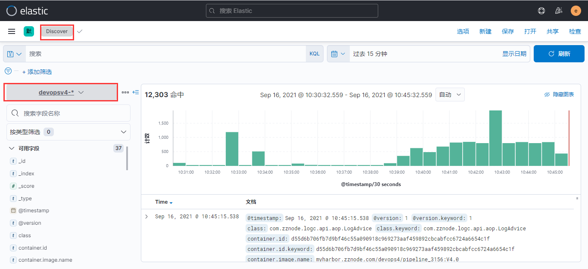

# ELK日志采集配置

## Filebeat配置

Filebeat配置分为三个部分，以下为第一部分输入部分，此处根据不同namespace配置不同的输入，并根据容器日志文件的命名规则匹配相对应namespace下容器的日志进行采集（通常容器日志文件的命名为``[podName]_[nameSpace]_[depoymentName]-[containerId].log``）,再将多行日志以一定的格式规则进行合并，最后添加自定义属性（此处添加的属性对应Kafka的Topic）。

```yaml
filebeat.inputs:
    - type: container # 类型选择容器类型
      enabled: true
      paths:
        - /var/log/containers/*_kube-system_*.log # 采集日志文件路径
      # 多行合并,将不是以日期开头或者[开头的行合并到上一行
      multiline.pattern: '^[0-9]{4}-[0-9]{2}-[0-9]{2}|^\['
      multiline.negate: true
      multiline.match: after
      multiline.timeout: 30
      fields:
        # 自定义属性字段用于标识和过滤数据
        kafka_topic: kube-system
```

官方文档：https://www.elastic.co/guide/en/beats/filebeat/current/filebeat-input-container.html

第二部分处理部分，此处为采集的日志都添加相应的k8s元数据信息并删除多余不需要的信息。

```yaml
processors:
      - add_kubernetes_metadata:
          # 添加k8s描述字段
          default_indexers.enabled: true
          default_matchers.enabled: true
          host: ${NODE_NAME}
          matchers:
          - logs_path:
              logs_path: "/var/log/containers/"
      - drop_fields:
          # 删除的多余字段
          fields: ["host", "tags", "ecs", "log", "prospector", "agent", "input", "beat", "offset"]
          ignore_missing: true  
```

官方文档：https://www.elastic.co/guide/en/beats/filebeat/current/add-kubernetes-metadata.html

第三部分输出部分，此处统一输出到Kafka集群，根据之前的属性配置将不同的namespace的日志输出到不同Topic中（Topic无需手动创建，会自动创建）。

```yaml
output.kafka:
      enabled: true
      # 对应Kafka集群的地址
      hosts: ["kafka:9092"]
      # 对应Kafka的Topic名称
      topic: '%{[fields.kafka_topic]}'
      partition.round_robin:
        reachable_only: true
```

官方文档：https://www.elastic.co/guide/en/beats/filebeat/current/kafka-output.html

最后，汇总配置文件：

```yaml
filebeat.inputs:
    - type: container
      enabled: true
      paths:
        - /var/log/containers/*_kube-system_*.log
      # 多行合并,将不是以日期开头或者[开头的行合并到上一行
      multiline.pattern: '^[0-9]{4}-[0-9]{2}-[0-9]{2}|^\['
      multiline.negate: true
      multiline.match: after
      multiline.timeout: 30
      fields:
        # 自定义字段用于logstash识别k8s输入的日志
        kafka_topic: kube-system
    - type: container
      enabled: true
      paths:
        - /var/log/containers/*_ceph_*.log
      # 多行合并,将不是以日期开头或者[开头的行合并到上一行
      multiline.pattern: '^[0-9]{4}-[0-9]{2}-[0-9]{2}|^\['
      multiline.negate: true
      multiline.match: after
      multiline.timeout: 30
      fields:
        # 自定义字段用于logstash识别k8s输入的日志
        kafka_topic: ceph  
    - type: container
      enabled: true
      paths:
        - /var/log/containers/*_kube-ops_*.log
      # 多行合并,将不是以日期开头或者[开头的行合并到上一行
      multiline.pattern: '^[0-9]{4}-[0-9]{2}-[0-9]{2}|^\['
      multiline.negate: true
      multiline.match: after
      multiline.timeout: 30
      fields:
        # 自定义字段用于logstash识别k8s输入的日志
        kafka_topic: kube-ops  
    - type: container
      enabled: true
      paths:
        - /var/log/containers/*_ingress-nginx_*.log
      # 多行合并,将不是以日期开头或者[开头的行合并到上一行
      multiline.pattern: '^[0-9]{4}-[0-9]{2}-[0-9]{2}|^\['
      multiline.negate: true
      multiline.match: after
      multiline.timeout: 30
      fields:
        # 自定义字段用于logstash识别k8s输入的日志
        kafka_topic: ingress-nginx  
    - type: container
      enabled: true
      paths:
        - /var/log/containers/*_elk_*.log
      # 多行合并,将不是以日期开头或者[开头的行合并到上一行
      multiline.pattern: '^[0-9]{4}-[0-9]{2}-[0-9]{2}|^\['
      multiline.negate: true
      multiline.match: after
      multiline.timeout: 30
      fields:
        # 自定义字段用于logstash识别k8s输入的日志
        kafka_topic: elk
    - type: container
      enabled: true
      paths:
        - /var/log/containers/*_kuboard_*.log
      # 多行合并,将不是以日期开头或者[开头的行合并到上一行
      multiline.pattern: '^[0-9]{4}-[0-9]{2}-[0-9]{2}|^\['
      multiline.negate: true
      multiline.match: after
      multiline.timeout: 30
      fields:
        # 自定义字段用于logstash识别k8s输入的日志
        kafka_topic: kuboard        
      
    processors:
      - add_kubernetes_metadata:
          # 添加k8s描述字段
          default_indexers.enabled: true
          default_matchers.enabled: true
          host: ${NODE_NAME}
          matchers:
          - logs_path:
              logs_path: "/var/log/containers/"
      - drop_fields:
          # 删除的多余字段
          fields: ["host", "tags", "ecs", "log", "prospector", "agent", "input", "beat", "offset"]
          ignore_missing: true  
    
    output.kafka:
      enabled: true
      # initial brokers for reading cluster metadata
      hosts: ["kafka:9092"]
      # message topic selection + partitioning
      topic: '%{[fields.kafka_topic]}'
      partition.round_robin:
        reachable_only: true
    #output.console:
    #  pretty: true
    #logging.level: debug
```

## Kafka配置

无需在Kafka中手动创建相应Topic，Filebeat会自动创建Topic。

以下为Kafka常用命令，用于检查数据是否在Kafka中正常生产与消费：

```shell
# 列出Topic
kubectl -n elk exec kafka-0 -- /opt/bitnami/kafka/bin/kafka-topics.sh --zookeeper kafka-zookeeper:2181 --list
# 查看Topic
kubectl -n elk exec kafka-0 -- /opt/bitnami/kafka/bin/kafka-topics.sh --zookeeper kafka-zookeeper:2181 --describe --topic kube-system
# 生产数据，推荐进入容器中执行
kubectl -n elk exec kafka-0 -- /opt/bitnami/kafka/bin/kafka-console-producer.sh --broker-list 127.0.0.1:9092 --topic kube-system
# 消费数据
kubectl -n elk exec -ti kafka-0 -- /opt/bitnami/kafka/bin/kafka-console-consumer.sh --bootstrap-server 127.0.0.1:9092 --topic kube-system --from-beginning
# 查看消费情况
kubectl -n elk exec kafka-0 -- /opt/bitnami/kafka/bin/kafka-consumer-groups.sh --bootstrap-server 127.0.0.1:9092 --group k8s-log --describe
```

## Logstash管道配置

Logstash配置同样分为三个部分，第一部分输入部分，从Kafka的Topic中获取数据，设置消费者组的id以及客户端id，并可以添加自定义属性。

```yaml
input {
      # 从kafka集群消费消息
      kafka {
        # Kafka的Topic
        topics => ["kube-system","ceph","kube-ops","ingress-nginx","elk","kuboard"]
        # 消费者组id
        group_id => "k8s-log"
        # 客户端id，当消息来自同源Kafka时，需要配置client_id，不然就会采用默认id logstash，发生冲突
        client_id => "devopsV4"
        # 消费者线程数，最好与Topic的partition数目一致
        consumer_threads => 3
        # 偏移量重设
        auto_offset_reset => "latest"
        # Kafka地址
        bootstrap_servers => "kafka:9092"
        # 输入格式
        codec => "json"
        # 添加自定义属性
        add_field => {"type" => "system"}
      }
    }
```

官方文档：https://www.elastic.co/guide/en/logstash/current/plugins-inputs-kafka.html

第二部分过滤部分，采用grok插件进行正则匹配，截取日志中的字段。

```yaml
filter {
      if [type] == "devopsV4" {
        grok {
          match => { "message" => "%{TIMESTAMP_ISO8601:datetime}[\s]*%{LOGLEVEL:level}\s*[0-9]?\s*\-*\s*\[?(?<thread>[a-zA-Z0-9\-]*)\]?\s*(?<class>[a-zA-Z0-9\.]*)\s*\:?%{GREEDYDATA:message}|%{GREEDYDATA:message}" }
          overwrite => [ "message" ]
        }
      }
    }
```

官方文档：https://www.elastic.co/guide/en/logstash/current/plugins-filters-grok.html

github文档：https://github.com/logstash-plugins/logstash-patterns-core/blob/master/patterns/ecs-v1/grok-patterns

第三部分输出部分，采用Elasticsearch插件将日志输出到es中，并将索引以一定规则命名。

```yaml
output {
      if [type] == "system" {
        elasticsearch {
          # 当输出到相同目标es时，需要添加id加以区分
          id => "system"
          # es地址
          hosts => ["elasticsearch-client:9200"]
          # es索引命名
          index => "k8s-%{[kubernetes][namespace]}-%{[kubernetes][pod][name]}-%{+YYYY.MM.dd}"
          # es用户
          user => "elastic"
          # es密码
          password => "admin@123"
        }
      }
    } 
```

官方文档：https://www.elastic.co/guide/en/logstash/current/plugins-outputs-elasticsearch.html

最后，汇总配置文件：

```yaml
input {
      #从kafka集群消费消息
      kafka {
        topics => ["kube-system","ceph","kube-ops","ingress-nginx","elk","kuboard"]
        group_id => "k8s-log"
        consumer_threads => 3
        auto_offset_reset => "latest"
        bootstrap_servers => "kafka:9092"
        codec => "json"
        add_field => {"type" => "system"}
      }
      kafka {
        topics => ["devopsV4-zznode"]
        group_id => "devopsV4"
        #当消息相同源Kafka的消息时，需要配置client_id，不然就会采用默认id logstash，发生冲突
        client_id => "devopsV4"
        consumer_threads => 3
        auto_offset_reset => "latest"
        bootstrap_servers => "kafka:9092"
        codec => "json"
        add_field => {"type" => "devopsV4"}
      }
    }
    
    filter {
      if [type] == "devopsV4" {
        grok {
          match => { "message" => "%{TIMESTAMP_ISO8601:datetime}[\s]*%{LOGLEVEL:level}\s*[0-9]?\s*\-*\s*\[?(?<thread>[a-zA-Z0-9\-]*)\]?\s*(?<class>[a-zA-Z0-9\.]*)\s*\:?%{GREEDYDATA:message}|%{GREEDYDATA:message}" }
          overwrite => [ "message" ]
        }
      }
    }
    
    output {
      if [type] == "system" {
        elasticsearch {
          #当输出到相同es时，需要添加id加以区分
          id => "system"
          hosts => ["elasticsearch-client:9200"]
          index => "k8s-%{[kubernetes][namespace]}-%{[kubernetes][pod][name]}-%{+YYYY.MM.dd}"
          user => "elastic"
          password => "admin@123"
        }
      }
      if [type] == "devopsV4" {
        elasticsearch {
          id => "devopsV4"
          hosts => ["elasticsearch-client:9200"]
          #index名称必须小写
          index => "devopsv4-%{[kubernetes][namespace]}-%{[kubernetes][pod][name]}-%{+YYYY.MM.dd}"
          user => "elastic"
          password => "admin@123"
        }
        #stdout { codec => json }
      }
    } 
```

## ElasticSearch配置

ElasticSearch无需配置，可通过ElasticSearch-Head查看分片情况。

## Kibana配置

登陆Kibana界面，创建索引模式匹配ElasticSearch上索引的名称。


根据创建的索引模式，查看相关匹配的索引。



## 相关参考

### 为什么采集/var/log/containers下的日志文件？

K8S中的日志目录有以下三种：

- /var/lib/docker/containers/
- /var/log/containers/
- /var/log/pods/

当Docker 作为 k8s 容器运行时，容器日志的落盘将由 docker 来完成，保存在/var/lib/docker/containers/$CONTAINERID 目录下。Kubelet 会在 /var/log/pods 和 /var/log/containers 下建立软链接，指向 /var/lib/docker/containers/CONTAINERID 该目录下的容器日志文件。
当Containerd 作为 k8s 容器运行时， 容器日志的落盘由 Kubelet 来完成，保存至 /var/log/pods/$CONTAINER_NAME 目录下，同时在 /var/log/containers 目录下创建软链接，指向日志文件。

无论k8s使用哪种容器运行时，最终的日志都是读取的`xxx-json.log`，是由容器以json格式`stdout`输出的，了解这些后我们得到了`统一的日志收集规则`：

- 统一目录 ：/var/log/containers
- 统一的输出方式：stdout
- 统一的日志格式：json

``当docker的存储路径自定义，上述软连接的目录也会相应发生改变，需要根据实际情况判断。``

### 添加K8s信息后的日志格式

```json
{
  "@timestamp": "2021-04-19T07:07:36.065Z",
  "@metadata": {
    "beat": "filebeat",
    "type": "_doc",
    "version": "7.11.2"
  },
  "log": {
    "offset": 377708,
    "file": {
      "path": "/var/log/containers/geip-gateway-test-85545c868b-6nsvc_geip-function-test_geip-gateway-test-server-885412c0a8af6bfa7b3d7a341c3a9cb79a85986965e363e87529b31cb650aec4.log"
    }
  },
  "fields": {
    "env": "dev",
    "log_topic": "geip-function-test"
  },
  "host": {
    "name": "filebeat-fv484"
  },
  "agent": {
    "id": "7afbca43-3ec1-4cee-b5cb-1de1e955b717",
    "name": "filebeat-fv484",
    "type": "filebeat",
    "version": "7.11.2",
    "hostname": "filebeat-fv484",
    "ephemeral_id": "8fd29dee-da50-4c88-88d5-ebb6bbf20772"
  },
  "ecs": {
    "version": "1.6.0"
  },
  "stream": "stdout",
  "message": "2021-04-19 15:07:36.065  INFO 23 --- [trap-executor-0] c.n.d.s.r.aws.ConfigClusterResolver      : Resolving eureka endpoints via configuration",
  "input": {
    "type": "container"
  },
  "container": {
    "image": {
      "name": "packages.gxxxxxn.com/docxxxxxp/gexxxxxxxst:3.3.1-ent-release-SNAPSHOT.20210402191241_87c9b1f841c"
    },
    "id": "885412c0a8af6bfa7b3d7a341c3a9cb79a85986965e363e87529b31cb650aec4",
    "runtime": "docker"
  },
  "kubernetes": {
    "labels": {
      "pod-template-hash": "85545c868b",
      "app": "geip-gateway-test"
    },
    "container": {
      "name": "geip-gateway-test-server",
      "image": "packages.xxxxxxx.com/dxxxxxp/gxxxxxxxxt:3.3.1-ent-release-SNAPSHOT.20210402191241_87c9b1f841c"
    },
    "node": {
      "uid": "511d9dc1-a84e-4948-b6c8-26d3f1ba2e61",
      "labels": {
        "kubernetes_io/hostname": "k8s-node-09",
        "kubernetes_io/os": "linux",
        "beta_kubernetes_io/arch": "amd64",
        "beta_kubernetes_io/os": "linux",
        "cloudt-global": "true",
        "kubernetes_io/arch": "amd64"
      },
      "hostname": "k8s-node-09",
      "name": "k8s-node-09"
    },
    "namespace_uid": "4fbea846-44b8-4d4a-b03b-56e43cff2754",
    "namespace_labels": {
      "field_cattle_io/projectId": "p-lgxhz",
      "cattle_io/creator": "norman"
    },
    "pod": {
      "name": "gxxxxxxxxst-85545c868b-6nsvc",
      "uid": "1e678b63-fb3c-40b5-8aad-892596c5bd4d"
    },
    "namespace": "geip-function-test",
    "replicaset": {
      "name": "geip-gateway-test-85545c868b"
    }
  }
}
```

由上述json可以看出有很多多余信息在日志中，因此需要在processor中进行过滤。

### ElasticSearch-Head安装

```shell
# ElasticSearch添加跨域访问配置
http.cors.enabled: true
http.cors.allow-origin: "*"
http.cors.allow-headers: AHuthorization,X-Requested-With,Content-Length,Content-Type
# 启动ElasticSearch-Head
docker run -d -p 9110:9100 mobz/elasticsearch-head:5
# 访问带有用户密码的ElasticSearch集群时ElasticSearch-Head的访问地址后面要添加用户密码信息
http://10.1.19.50:9110/?auth_user=elastic&auth_password=admin@123
```


