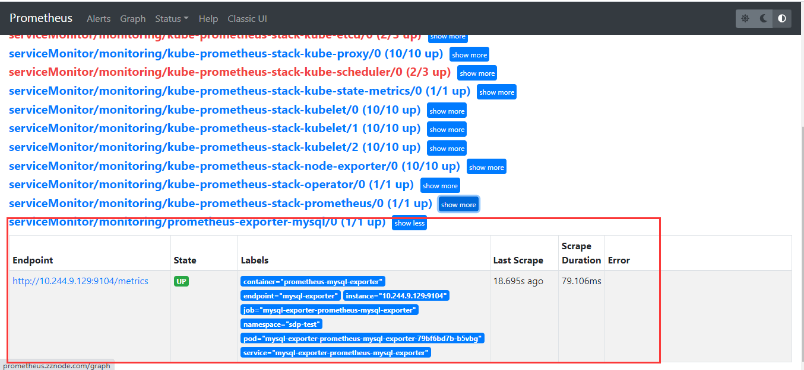
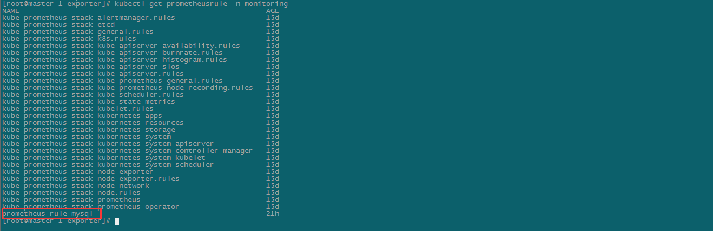
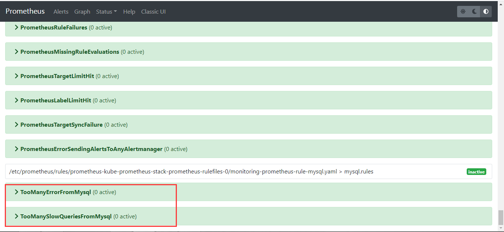
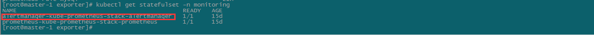
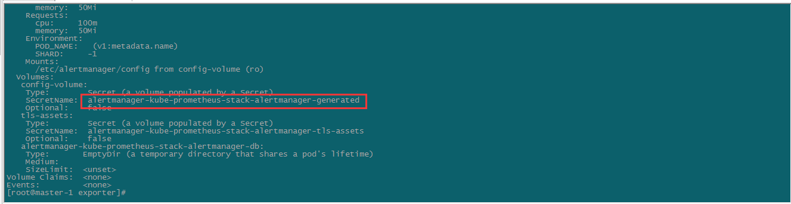
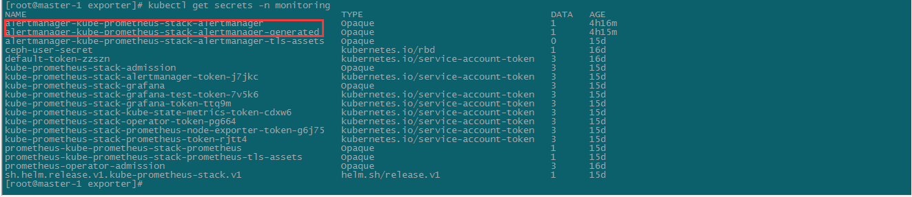
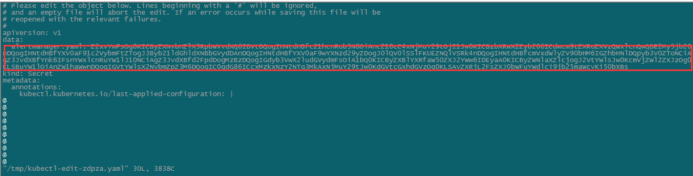
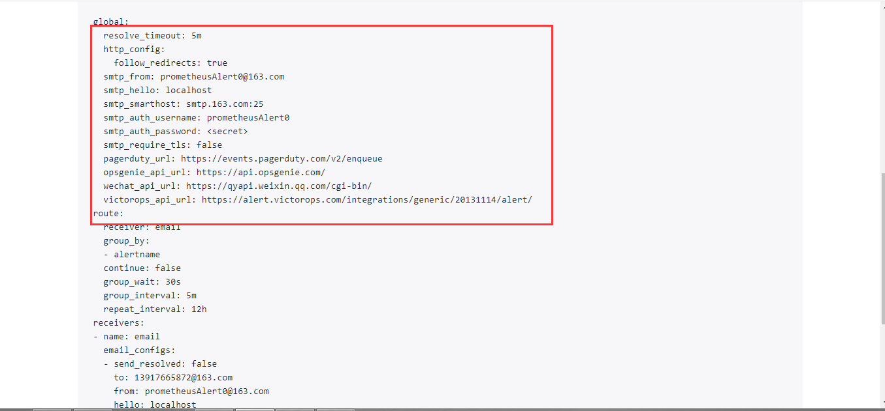

# Prometheus自定义监控配置

本文以mysql监控为例，演示如何在Prometheus中自定义监控配置。

先决条件：

1. 已搭建好kubernetes集群
2. 已通过使用prometheus-operator来部署好了Prometheus服务
3. kubernetes中已经成功安装好了mysql

## 1.创建mysql-exporter用户

```shell
#在被监控mysql中执行如下sql，创建mysql-exporter对应用户
CREATE USER 'mysqlexporter'@"%"  IDENTIFIED BY 'mysqlexporter';
GRANT PROCESS, REPLICATION CLIENT, SELECT ON *.* TO 'mysqlexporter'@'%'  IDENTIFIED BY 'mysqlexporter' WITH MAX_USER_CONNECTIONS 30; 
GRANT select on performance_schema.* to "mysqlexporter"@"%" IDENTIFIED BY 'mysqlexporter';
flush privileges;
```

## 2.安装mysql-exporter

```she
#下载mysql-exporter的chart
helm search repo mysql-exporter
helm pull stable/prometheus-mysql-exporter
tar -zxvf prometheus-mysql-exporter-0.7.1.tgz
```

修改values.yaml中的配置：

```shell
mysql:
  db: ""
  host: "10.244.9.127"
  param: ""
  pass: "mysqlexporter"
  port: 3306
  protocol: ""
  user: "mysqlexporter"
  existingSecret: false
```

安装mysql-exporter

```shell
helm install mysql-exporter -f values.yaml ./prometheus-mysql-exporter -n sdp-test
```

## 3.创建ServiceMonitor

```shell
#servicemonitor.yaml
apiVersion: monitoring.coreos.com/v1
kind: ServiceMonitor  #资源类型为ServiceMonitor
metadata:
  labels:
    release: kube-prometheus-stack #prometheus默认通过 prometheus: kube-prometheus发现ServiceMonitor，只要写上这个标签prometheus服务就能发现这个ServiceMonitor
  name: prometheus-exporter-mysql
  namespace: monitoring
spec:
  jobLabel: mysql #jobLabel指定的标签的值将会作为prometheus配置文件中scrape_config下job_name的值，也就是Target，如果不写，默认为service的name
  selector:
    matchLabels:
      app: prometheus-mysql-exporter #由于前面查看mysql-exporter的service信息中标签包含了app: prometheus-mysql-exporter这个标签，写上就能匹配到
      release: mysql-exporter
  namespaceSelector:
    any: true #表示从所有namespace中去匹配，如果只想选择某一命名空间中的service，可以使用matchNames: []的方式
    # mathNames： []
  endpoints:
  - port: mysql-exporter #前面查看mysql-exporter的service信息中，提供mysql监控信息的端口是Port: mysql-exporter  9104/TCP，所以这里填mysql-exporter
    interval: 30s #每30s获取一次信息
  # path: /metrics HTTP path to scrape for metrics，默认值为/metrics
    honorLabels: true
```

```shell
kubectl create -f servicemonitor.yaml
```

成功以后在prometheus界面上可以看到如下target：



# Prometheus自定义告警配置

本文同样以mysql的自定义邮件告警为示例，演示如何配置自定义告警。

## 1.动态创建PrometheusRule

```shell
#mysql-rules.yaml
apiVersion: monitoring.coreos.com/v1 #这和ServiceMonitor一样
kind: PrometheusRule  #该资源类型是Prometheus，这也是一种自定义资源（CRD）
metadata:
  labels:
    app: kube-prometheus-stack
    release: kube-prometheus-stack  #同ServiceMonitor，ruleSelector也会默认选择标签为prometheus: kube-prometheus的PrometheusRule资源
  name: prometheus-rule-mysql
  namespace: monitoring
spec:
  groups: #编写告警规则，和prometheus的告警规则语法相同
  - name: mysql.rules
    rules:
    - alert: TooManyErrorFromMysql
      expr: sum(irate(mysql_global_status_connection_errors_total[1m])) > 10
      labels:
        severity: critical
      annotations:
        description: mysql产生了太多的错误.
        summary: TooManyErrorFromMysql
    - alert: TooManySlowQueriesFromMysql
      expr: increase(mysql_global_status_slow_queries[1m]) > 10
      labels:
        severity: critical
      annotations:
        description: mysql一分钟内产生了{{ $value }}条慢查询日志.
        summary: TooManySlowQueriesFromMysql
```

```shell
kubectl apply -f mysql-rules.yaml
```

创建完成后，查看创建的PrometheusRule以及告警规则：





## 2.动态更新Alertmanager配置

查找alertmanager配置对应的sercets：



```shell
kubectl describe sts alertmanager-kube-prometheus-stack-alertmanager -n monitoring
```





编辑alertmanager-kube-prometheus-stack-alertmanager修改对应配置（其中data的内容为base64加密）：

```yaml
#alertmanager.yaml
global:
  resolve_timeout: 5m
  smtp_smarthost: 'smtp.163.com:25'
  smtp_from: 'prometheusAlert0@163.com'
  smtp_auth_username: 'prometheusAlert0'
  smtp_auth_password: 'IPWIRJQJPFMBURFN'
  smtp_require_tls: false
route:
  group_by: ['alertname']
  group_wait: 30s
  group_interval: 5m
  repeat_interval: 12h
  receiver: 'email'
receivers:
- name: 'email'
  email_configs:
  - to: '13917665872@163.com'
templates:
- /etc/alertmanager/config/*.tmpl
```

```shell
base64 alertmanager.yaml > secrets.txt
```

```shell
kubectl edit secrets alertmanager-kube-prometheus-stack-alertmanager -n monitoring
```

将alertmanager.yaml后面的内容替换为secrets.txt中的内容，并删除alertmanager-kube-prometheus-stack-alertmanager-generated secret：



修改完成后，查看alertmanager前台配置，已经更新：

