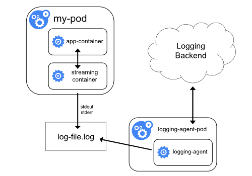
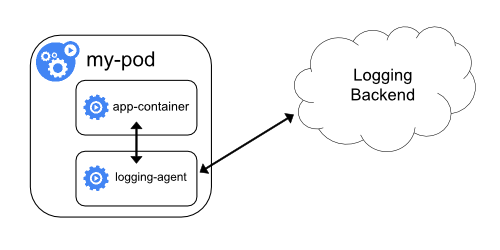
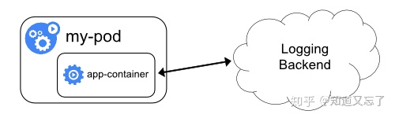

# kubernetes日志收集方案

在kubernetes中对日志的处理方式叫做cluster-level-logging，即这个日志处理系统跟容器，Pod，Node的生命周期无关，也就是无论是容器挂了，Pod被删除了还是Node宕机了，应用的日志应该被正常获取到。

对于容器来说，当应用把日志输出到stdout和stderr中时，容器默认情况下就会把这些日志输出到[宿主机](https://cloud.tencent.com/product/cdh?from=10680)上的一个 JSON 文件之中，同样我们也可以通过 docker logs 或者 kubectl logs 来查看到对应的日志信息。

但是kubernetes本身并不提供日志收集工作，但是它提供了三种方案。

## 一、在Node上部署logging agent

这种方案的架构如下：

这种架构的核心点就在logging-agent，通常情况下它会以DS的方式运行在节点上，然后将宿主机的容器日志目录挂载进去，然后由logging-agent将日志收集转发出去。常用的方案有EFK，即用fluentd作为上面的logging-agent，然后将日志转发到远端的ElasticSearch中，然后由kibana进行展示。

这种方案的优点是只需要在节点部署一个logging-agent，而且不会对应用和Pod有任何侵入性，但是其缺点就是必须要应用的日志输出必须输出到stdout和stderr中去。

## 二、sidecar收集日志

由于第一种方式无法收集一些没有标准输出到stdout和stderr中，所以就有了第二种方式对这种特殊情况进行处理：当容器的日志只能输出到某些文件的时候，就可以通过一个sidecar容器把这些日志重新输出到sidecar的stdout和stderr中去，这样就可以继续使用第一种方案进行日志再处理。

其架构如下：

比如我有一个pod，它会把日志输出到1.log和2.log的文件中。

这种情况下，用kubectl logs是看不到任何日志的，所以第一种方法就没办法使用，那么这个时候我们就可以创建两个sidecar容器，分别将这两个日志输出到stdout和stderr中。

这时候分别通过kubectl logs查看这两个sidecar容器，就可以看到相应的日志内容了。

由于sidecar跟主容器是共享volume的，所以这里的sidecar方案其实并不会占用太多的资源。但是这种办法实际上是会存在两份文件，一份是系统自己写的文件，第二份是通过sidecar输出到stdout和stderr中所对应的JSON文件，多以对磁盘来说是一个大的开销。

## 三、以sidecar运行logging-agent

这种方案就是直接在sidecar中运行logging-agent，直接将日志转发到后端存储，也就是相当于在方案一中将logging-agent放到一个Pod中了，其架构如下：

在这个方案中，应用可以直接把日志输出到一个文件中，我们的logging-agent可以使用fluentd收集日志转发到后端ElasticSearch中，不过这里的输入源变成了日志文件。

一般来说，我们会把fluentd的输入源配置保存在ConfigMap中，然后我们在Pod的定义里，就可以声明一个Fluentd的sidecar，专门负责将日志转发到后端ElasticSearch中去。

这样虽然更加灵活，但是在 sidecar 容器中运行日志采集代理程序会导致大量资源消耗，因为你有多少个要采集的 Pod，就需要运行多少个采集代理程序，另外还无法使用 kubectl logs 命令来访问这些日志，因为它们不受 kubelet 控制。

## 四、应用容器中直接将日志推到存储后端

这种方式就比较简单了，直接在应用里面将日志内容发送到日志收集服务后端。

参考文章：

https://blog.csdn.net/Cui_Cui_666/article/details/103821140

https://zhuanlan.zhihu.com/p/70662744

https://www.cnblogs.com/Dev0ps/p/10778962.html

