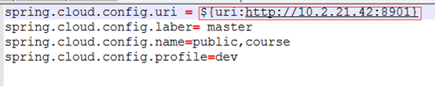
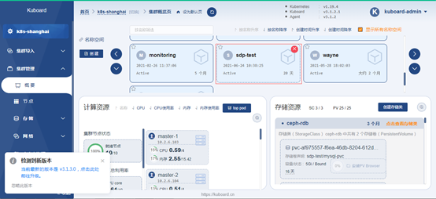

# 应用系统部署

本文以SpringCloud的微服务SDP项目为例，演示如何将应用系统部署到K8s中。SDP项目由Config-server、Eureka、Zuul、exam、course等微服务组成，项目中使用到的中间件包含Mysql、Redis以及RabbitMQ。本节中将对这些微服务进行统一改造部署，实现全容器化部署。

## 配置文件改造

本节将对Config-server、Eureka、Zuul、exam、course等微服务进行配置改造，用部分变量替换传统值配置，由K8s传入这些变量，实现灵活配置的目的。

### Config-server配置修改

修改Config-server对应的application.properties文件，将其中的服务端口、Eureka地址替换为变量（后续由Yaml文件中的环境变量传入），并设置微服务自身向Eureka注册名为ip加端口，以便微服务后续互相调用。


**备注：server.port=${port:8901} 代表server.port配置项的值等于变量port，且变量port的默认值为8901。其余配置项类似，不再一一赘述。**

### Eureka配置修改

修改Eureka对应的application.properties文件，将其中的服务端口以及自身主机名替换为变量。


### Zuul配置修改

修改Zuul对应的bootstrap.properties文件，将其中的配置中心地址替换为变量。


修改Zuul对应的public-dev.properties文件，将其中Eureka地址、redis地址以及Mysql地址替换为变量。


修改Zuul对应的zuul-dev.properties文件，将其中服务端口号替换为变量。


### 应用配置修改

修改应用微服务对应的bootstrap.properties文件，将配置中心地址替换为变量。



修改应用微服务对应的course-dev.properties文件，将服务端口号替换为变量。


**备注：其他微服务类似修改方式，不在一一赘述。**

至此，所有微服务的配置改造已完成，替换为变量的配置项后续都将在YAML中由环境变量传入，以达到基于K8s灵活配置的目的。

## 镜像制作

本节主要讲述如何制作K8s镜像，已经编译打包完成的jar包是制作镜像的基础条件。

### 编写Dockerfile

本节以Config-server的Dockerfile为例，演示如何编写Dockerfile。

Config-server的基础镜像采用jdk8的镜像，将编译完成后的jar包放入docker镜像中，并启动对应jar包。


编写完成后，将完成的Dockerfile上传至对应的代码仓库。


### 制作镜像

在项目代码目录下，执行以下命令，制作Config-server的镜像：

```shell
docker build -t myharbor.zznode.com/sdp_test/config-server:v1 .
```

**备注：此处镜像tag使用后续要上传harbor的地址，方便后续上传镜像。**

###  上传镜像

首先，创建Harbor私有项目sdp_test用于存放上传的镜像。


其次，在K8s的master节点上创建secret，用于后续K8s镜像下载的凭证：

```shell
kubectl create secret docker-registry myharbor --docker-server=myharbor.zznode.com --docker-username=admin --docker-password=Harbor12345 -n sdp-test
```

最后，登陆harbor仓库并上传制作的镜像：

```shell
docker login myharbor.zznode.com -u admin -p Harbor12345;
docker push myharbor.zznode.com/sdp_test/config-server:v1
```

## YAML编写

本节以Config-server和course应用服务为例，演示如何编写YAML文件，YAML中的环境变量与配置改造中的变量相互对应。

config-server.yaml:

```yaml
apiVersion: apps/v1
kind: Deployment
metadata:
  name: config-server
  namespace: sdp-test
  labels:
    app: config-server
spec:
  replicas: 1
  selector:
    matchLabels:
      app: config-server
  template:
    metadata:
      labels:
        app: config-server
    spec:
      containers:
      - name: config-server
        image: myharbor.zznode.com/sdp_test/config-server:v1
        imagePullPolicy: Always          
        ports:
        - containerPort: 8901
        env:
        - name: "port"
          value: "8901"
        - name: "defaultZone"
          value: "http://eureka-service:8761/eureka/"
      restartPolicy: Always
      imagePullSecrets:
        - name: myharbor
```

config-service.yaml:

```yaml
apiVersion: v1
kind: Service
metadata:
  name: config-service	#Service 的名称
  namespace: sdp-test
  labels:     	#Service 自己的标签
    app: config-server	#为该 Service 设置 key 为 app，value 为 nginx 的标签
spec:	    #这是关于该 Service 的定义，描述了 Service 如何选择 Pod，如何被访问
  selector:	    #标签选择器
    app: config-server	#选择包含标签 app:nginx 的 Pod
  ports:
  - name: config-port	#端口的名字
    protocol: TCP	    #协议类型 TCP/UDP
    port: 8901	        #集群内的其他容器组可通过 80 端口访问 Service
    nodePort: 38901   #通过任意节点的 32600 端口访问 Service
    targetPort: 8901	#将请求转发到匹配 Pod 的 80 端口
  type: NodePort	#Serive的类型，ClusterIP/NodePort/LoaderBalancer
```

course.yaml:

```yaml
apiVersion: apps/v1
kind: Deployment
metadata:
  name: course
  namespace: sdp-test
  labels:
    app: course
spec:
  replicas: 1
  selector:
    matchLabels:
      app: course
  template:
    metadata:
      labels:
        app: course
    spec:
      containers:
      - name: course
        image: myharbor.zznode.com/sdp_test/course:v1
        imagePullPolicy: Always       
        ports:
        - containerPort: 9901
        env:
        - name: "uri"
          value: "http://config-service:8901"
        - name: "port"
          value: "9901"
        - name: "defaultZone"
          value: "http://eureka-service:8761/eureka/"
        - name: "redisIp"
          value: "redis-service:6379"
        - name: "mysqlIp"
          value: "jdbc:mysql://mysql-service:3306/esi?useUnicode=true&characterEncoding=utf8"
      restartPolicy: Always
      imagePullSecrets:
        - name: myharbor
```

## 应用部署

本节利用Kuboard进行应用部署，首先登陆Kuboard，进入对应K8s集群，创建sdp-test命名空间，其次进入创建的sdp-test命名空间，将编写完成的YAML复制并执行，最后在界面中观察服务是否部署成功。





## 中间件部署

本节针对Mysql、Redis以及RabbitMQ进行容器化部署。

### Mysql部署

本节采用单节点的Mysql作为示例，首先，在Master节点执行如下命令，创建mysql所依赖的配置文件：

```shell
kubectl create configmap mysql-config --from-file=mysqld.cnf -n sdp-test;
```

其次，在Kuboard上执行如下yaml文件：

mysql.yaml:

```yaml
---
apiVersion: apps/v1
kind: StatefulSet
metadata:
    name: mysql
    namespace: sdp-test
spec:
  selector:
    matchLabels:
      app: mysql
  serviceName: "mysql"
  #podManagementPolicy: Parallel
  replicas: 1
  template:
    metadata:
      labels:
        app: mysql
    spec:
      terminationGracePeriodSeconds: 10
      containers:
      - name: mysql
        image: mysql:5.7
        env:
        - name: MYSQL_ROOT_PASSWORD
          value: "asb#1234"
        ports:
        - containerPort: 3306
          name: mysql
        volumeMounts:
        - name: mysql-data
          subPath: mysql
          mountPath: /var/lib/mysql
        - name: mysql-cfg
          mountPath: /etc/mysql/mysql.conf.d
      volumes:
      - name: mysql-cfg
        configMap:
          name: mysql-config
  volumeClaimTemplates:
  - metadata:
      name: mysql-data
    spec:
      storageClassName: "harbor-ceph-rdb"
      accessModes: [ "ReadWriteOnce" ]
      resources:
        requests:
          storage: 10Gi
```

mysql-svc.yaml:

```yaml
apiVersion: v1
kind: Service
metadata:
  name: mysql-service
  namespace: sdp-test
spec:
  selector:
    app: mysql
  type: NodePort
  ports:
  - port: 3306
    nodePort: 33306
    targetPort: 3306
```

### Redis部署

本节采用集群Redis作为示例，首先执行如下yaml文件：

redis-cluster.yaml：

```yaml
---
apiVersion: v1
kind: ConfigMap
metadata:
  name: redis-cluster
  namespace: sdp-test
data:
  update-node.sh: |
    #!/bin/sh
    REDIS_NODES="/data/nodes.conf"
    sed -i -e "/myself/ s/[0-9]\{1,3\}\.[0-9]\{1,3\}\.[0-9]\{1,3\}\.[0-9]\{1,3\}/${POD_IP}/" ${REDIS_NODES}
    exec "$@"
  redis.conf: |+
    cluster-enabled yes
    cluster-require-full-coverage no
    cluster-node-timeout 15000
    cluster-config-file /data/nodes.conf
    cluster-migration-barrier 1
    appendonly yes
    protected-mode no
---
apiVersion: apps/v1
kind: StatefulSet
metadata:
  name: redis-cluster
  namespace: sdp-test
spec:
  serviceName: redis-cluster
  replicas: 2
  selector:
    matchLabels:
      app: redis-cluster
  template:
    metadata:
      labels:
        app: redis-cluster
    spec:
      containers:
      - name: redis
        image: redis:5.0.5-alpine
        ports:
        - containerPort: 6379
          name: client
        - containerPort: 16379
          name: gossip
        command: ["/conf/update-node.sh", "redis-server", "/conf/redis.conf"]
        env:
        - name: POD_IP
          valueFrom:
            fieldRef:
              fieldPath: status.podIP
        volumeMounts:
        - name: conf
          mountPath: /conf
          readOnly: false
        - name: data
          mountPath: /data
          readOnly: false
      volumes:
      - name: conf
        configMap:
          name: redis-cluster
          defaultMode: 0755
  volumeClaimTemplates:
  - metadata:
      name: data
    spec:
      accessModes: [ "ReadWriteOnce" ]
      resources:
        requests:
          storage: 5Gi
      storageClassName: "harbor-ceph-rdb"
      
---
apiVersion: v1
kind: Service
metadata:
  name: redis-service
  namespace: sdp-test
spec:
  type: ClusterIP
  ports:
  - port: 6379
    targetPort: 6379
    name: client
  - port: 16379
    targetPort: 16379
    name: gossip
  selector:
    app: redis-cluster
---
apiVersion: v1
kind: Service
metadata:
  name: redis
  namespace: sdp-test
spec:
  selector:
    app: redis-cluster
  ports:
  - name: redis
    port: 6379
  clusterIP: None
```

其次，下载redis-tribe集群初始化工具，在Master节点执行如下命令：

```shell
kubectl run -it ubuntu --image=ubuntu --restart=Never -n sdp-test bash

cat > /etc/apt/sources.list << EOF
deb http://mirrors.tuna.tsinghua.edu.cn/ubuntu/ xenial main restricted
deb http://mirrors.tuna.tsinghua.edu.cn/ubuntu/ xenial-updates main restricted
deb http://mirrors.tuna.tsinghua.edu.cn/ubuntu/ xenial universe
deb http://mirrors.tuna.tsinghua.edu.cn/ubuntu/ xenial-updates universe
deb http://mirrors.tuna.tsinghua.edu.cn/ubuntu/ xenial multiverse
deb http://mirrors.tuna.tsinghua.edu.cn/ubuntu/ xenial-updates multiverse
deb http://mirrors.tuna.tsinghua.edu.cn/ubuntu/ xenial-backports main restricted universe multiverse
deb http://mirrors.tuna.tsinghua.edu.cn/ubuntu/ xenial-security main restricted
deb http://mirrors.tuna.tsinghua.edu.cn/ubuntu/ xenial-security universe
deb http://mirrors.tuna.tsinghua.edu.cn/ubuntu/ xenial-security multiverse
EOF

apt-get update
 
apt-get install -y libncursesw5 libreadline6 libtinfo5 --allow-remove-essential
 
apt-get install -y libpython2.7-stdlib python2.7 python-pip redis-tools dnsutils

pip install redis-trib==0.5.1
```

最后，使用redis-trib初始化集群：

```shell
redis-trib.py replicate \
 --master-addr 10.244.9.239:6379 \
 --slave-addr 10.244.3.57:6379
```

### RabbitMQ部署

本节采用单节点的RabbitMQ作为示例，执行如下yaml文件：

rabbitmq.yaml:

```yaml
apiVersion: apps/v1
kind: Deployment
metadata:
  name: rabbitmq
  namespace: sdp-test  
  labels:
    app: rabbitmq  
spec:
  selector:
    matchLabels:
      app: rabbitmq
  replicas: 1
  template:
    metadata:
      labels:
        app: rabbitmq
    spec:
      serviceAccountName: rabbitmq
      containers:
      - name: rabbitmq
        image: rabbitmq:3-management
        imagePullPolicy: IfNotPresent
        ports:
          - containerPort: 5672
            name: port-5672
          - containerPort: 4369
            name: port-4369
          - containerPort: 5671
            name: port-5671
          - containerPort: 15672
            name: port-15672
          - containerPort: 25672
            name: port-25672
        env:
          - name: AUTOCLUSTER_TYPE
            value: "k8s"
          - name: AUTOCLUSTER_DELAY
            value: "10"
          - name: AUTOCLUSTER_CLEANUP
            value: "true"
          - name: RABBITMQ_DEFAULT_USER
            value: admin
          - name: RABBITMQ_DEFAULT_PASS
            value: admin
          - name: HOSTNAME
            valueFrom:
             fieldRef:
              fieldPath: status.podIP
          - name: MY_POD_IP
            valueFrom:
             fieldRef:
              fieldPath: status.podIP
          - name: CLEANUP_INTERVAL
            value: "60"
          - name: CLEANUP_WARN_ONLY
            value: "false"
          - name: K8S_SERVICE_NAME
            value: "${RABBITMQ_SERVICE_HOST}"
          - name: K8S_ADDRESS_TYPE
            value: "hostname"
          - name: K8S_HOSTNAME_SUFFIX
            value: ".$(K8S_SERVICE_NAME)"
          - name: RABBITMQ_USE_LONGNAME
            value: "true"
          - name: K8S_HOST
            value: "${HOSTNAME}"
          - name: K8S_PORT
            value: "6443"
```

rabbitmq-svc.yaml:

```yaml
apiVersion: v1
kind: Service
metadata:
  labels:
    app: rabbitmq
  name: rabbitmq
  namespace: sdp-test  
spec:
  type: NodePort
  ports:
  - port: 5672
    name: port-5672
    protocol: TCP
    targetPort: 5672
  - port: 4369
    name: port-4369
    protocol: TCP
    targetPort: 4369    
  - port: 5671
    name: port-5671
    protocol: TCP
    targetPort: 5671    
  - port: 15672
    name: port-15672
    protocol: TCP
    targetPort: 15672
    nodePort: 15672
  - port: 25672
    name: port-25672
    protocol: TCP
    targetPort: 25672
  selector:
    app: rabbitmq
```

rabbiqmq-sa.yaml:

```yaml
apiVersion: v1
kind: ServiceAccount
metadata:
  name: rabbitmq
  namespace: sdp-test
---
kind: Role
apiVersion: rbac.authorization.k8s.io/v1
metadata:
  name: rabbitmq
  namespace: sdp-test
rules:
  - apiGroups:
      - ""
    resources:
      - endpoints
    verbs:
      - get
---
kind: RoleBinding
apiVersion: rbac.authorization.k8s.io/v1
metadata:
  name: rabbitmq
  namespace: sdp-test
roleRef:
  apiGroup: rbac.authorization.k8s.io
  kind: Role
  name: rabbitmq
subjects:
- kind: ServiceAccount
  name: rabbitmq
  namespace: sdp-test
```

