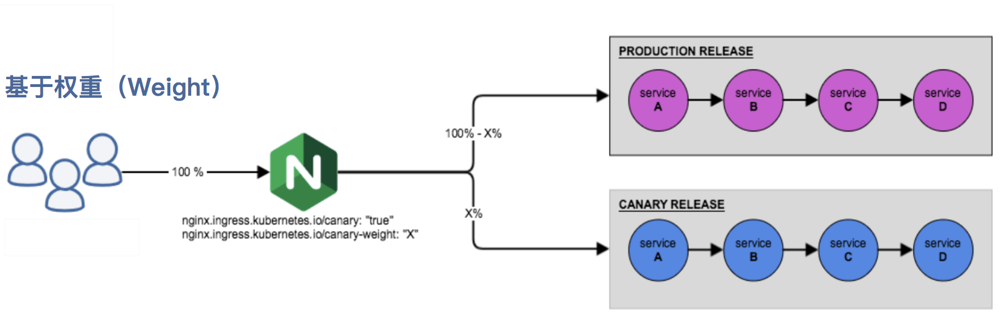
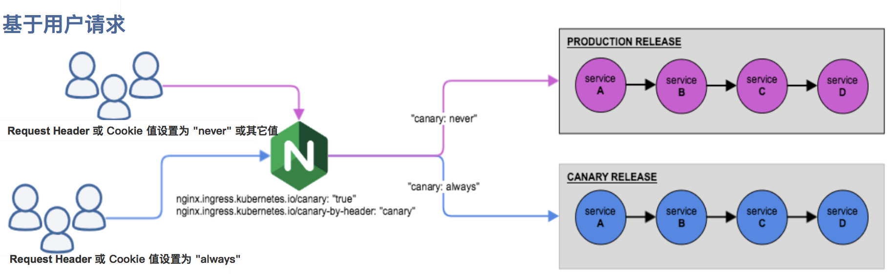

# 灰度发布

## 方案一

适用场景：流量随机分发到同一个Deployment下不同版本的应用，随机让部分用户体验新版本功能，流量分发不可控。

利用Deployment的滚动更新实现灰度发布:

```yaml
#首先创建Deployment
apiVersion: apps/v1
kind: Deployment
metadata:
  namespace: default
  name: podinfo
  labels:
    app: podinfo
spec:
  replicas: 4
  minReadySeconds: 5
  revisionHistoryLimit: 5
  progressDeadlineSeconds: 60
  strategy:
    rollingUpdate:
      maxSurge: 25%
      maxUnavailable: 0
    type: RollingUpdate
  selector:
    matchLabels:
      app: podinfo
  template:
    metadata:
      labels:
        app: podinfo
    spec:
      containers:
      - name: podinfod
        image: registry.cn-hangzhou.aliyuncs.com/acs/rollouts-demo:blue
        imagePullPolicy: IfNotPresent
        ports:
          - name: http
            containerPort: 8080
            protocol: TCP
        readinessProbe:
          tcpSocket:
            port: 8080
          initialDelaySeconds: 5
          failureThreshold: 3
          periodSeconds: 10
          successThreshold: 1
          timeoutSeconds: 5
```

更新pod所使用的镜像并暂停滚动更新：

```shell
kubectl set image deployment/podinfo -n default podinfod=registry.cn-hangzhou.aliyuncs.com/acs/rollouts-demo:green&& kubectl rollout pause deployment/podinfo
```

结果如下：

```shell
[root@master-1 ~]# kubectl get rs -o wide -w
NAME                   DESIRED   CURRENT   READY   AGE     CONTAINERS   IMAGES                                                      SELECTOR
k8s-hello-64d65f5dd6   1         1         1       97d     k8s-hello    myharbor.zznode.com/llll/k8s-hello:0.0.1                    app=k8s-hello,pod-template-hash=64d65f5dd6
podinfo-6f4fc69d77     4         4         4       5m33s   podinfod     registry.cn-hangzhou.aliyuncs.com/acs/rollouts-demo:blue    app=podinfo,pod-template-hash=6f4fc69d77
podinfo-85c4bdcdcd     1         1         1       84s     podinfod     registry.cn-hangzhou.aliyuncs.com/acs/rollouts-demo:green   app=podinfo,pod-template-hash=85c4bdcdcd
[root@master-1 ~]# 
```

至此，已完成部分pod的更新，实现灰度发布。

当此时完毕后，需要执行全量升级可执行如下命令恢复滚动更新即可：

```shell
kubectl rollout resume deployment/podinfo
```

结果如下：

```shell
[root@master-1 ~]# kubectl get rs -o wide -w
NAME                   DESIRED   CURRENT   READY   AGE    CONTAINERS   IMAGES                                                      SELECTOR
k8s-hello-64d65f5dd6   1         1         1       97d    k8s-hello    myharbor.zznode.com/llll/k8s-hello:0.0.1                    app=k8s-hello,pod-template-hash=64d65f5dd6
podinfo-6f4fc69d77     4         4         4       140m   podinfod     registry.cn-hangzhou.aliyuncs.com/acs/rollouts-demo:blue    app=podinfo,pod-template-hash=6f4fc69d77
podinfo-85c4bdcdcd     1         1         1       136m   podinfod     registry.cn-hangzhou.aliyuncs.com/acs/rollouts-demo:green   app=podinfo,pod-template-hash=85c4bdcdcd
podinfo-6f4fc69d77     3         4         4       140m   podinfod     registry.cn-hangzhou.aliyuncs.com/acs/rollouts-demo:blue    app=podinfo,pod-template-hash=6f4fc69d77
podinfo-6f4fc69d77     3         4         4       140m   podinfod     registry.cn-hangzhou.aliyuncs.com/acs/rollouts-demo:blue    app=podinfo,pod-template-hash=6f4fc69d77
podinfo-85c4bdcdcd     2         1         1       136m   podinfod     registry.cn-hangzhou.aliyuncs.com/acs/rollouts-demo:green   app=podinfo,pod-template-hash=85c4bdcdcd
podinfo-6f4fc69d77     3         3         3       140m   podinfod     registry.cn-hangzhou.aliyuncs.com/acs/rollouts-demo:blue    app=podinfo,pod-template-hash=6f4fc69d77
podinfo-85c4bdcdcd     2         1         1       136m   podinfod     registry.cn-hangzhou.aliyuncs.com/acs/rollouts-demo:green   app=podinfo,pod-template-hash=85c4bdcdcd
podinfo-85c4bdcdcd     2         2         1       136m   podinfod     registry.cn-hangzhou.aliyuncs.com/acs/rollouts-demo:green   app=podinfo,pod-template-hash=85c4bdcdcd
podinfo-85c4bdcdcd     2         2         2       136m   podinfod     registry.cn-hangzhou.aliyuncs.com/acs/rollouts-demo:green   app=podinfo,pod-template-hash=85c4bdcdcd
podinfo-85c4bdcdcd     2         2         2       136m   podinfod     registry.cn-hangzhou.aliyuncs.com/acs/rollouts-demo:green   app=podinfo,pod-template-hash=85c4bdcdcd
podinfo-6f4fc69d77     2         3         3       140m   podinfod     registry.cn-hangzhou.aliyuncs.com/acs/rollouts-demo:blue    app=podinfo,pod-template-hash=6f4fc69d77
podinfo-85c4bdcdcd     3         2         2       136m   podinfod     registry.cn-hangzhou.aliyuncs.com/acs/rollouts-demo:green   app=podinfo,pod-template-hash=85c4bdcdcd
podinfo-6f4fc69d77     2         3         3       140m   podinfod     registry.cn-hangzhou.aliyuncs.com/acs/rollouts-demo:blue    app=podinfo,pod-template-hash=6f4fc69d77
podinfo-6f4fc69d77     2         2         2       140m   podinfod     registry.cn-hangzhou.aliyuncs.com/acs/rollouts-demo:blue    app=podinfo,pod-template-hash=6f4fc69d77
podinfo-85c4bdcdcd     3         2         2       136m   podinfod     registry.cn-hangzhou.aliyuncs.com/acs/rollouts-demo:green   app=podinfo,pod-template-hash=85c4bdcdcd
podinfo-85c4bdcdcd     3         3         2       136m   podinfod     registry.cn-hangzhou.aliyuncs.com/acs/rollouts-demo:green   app=podinfo,pod-template-hash=85c4bdcdcd
podinfo-85c4bdcdcd     3         3         3       136m   podinfod     registry.cn-hangzhou.aliyuncs.com/acs/rollouts-demo:green   app=podinfo,pod-template-hash=85c4bdcdcd
podinfo-85c4bdcdcd     3         3         3       136m   podinfod     registry.cn-hangzhou.aliyuncs.com/acs/rollouts-demo:green   app=podinfo,pod-template-hash=85c4bdcdcd
podinfo-6f4fc69d77     1         2         2       140m   podinfod     registry.cn-hangzhou.aliyuncs.com/acs/rollouts-demo:blue    app=podinfo,pod-template-hash=6f4fc69d77
podinfo-85c4bdcdcd     4         3         3       136m   podinfod     registry.cn-hangzhou.aliyuncs.com/acs/rollouts-demo:green   app=podinfo,pod-template-hash=85c4bdcdcd
podinfo-6f4fc69d77     1         2         2       140m   podinfod     registry.cn-hangzhou.aliyuncs.com/acs/rollouts-demo:blue    app=podinfo,pod-template-hash=6f4fc69d77
podinfo-6f4fc69d77     1         1         1       140m   podinfod     registry.cn-hangzhou.aliyuncs.com/acs/rollouts-demo:blue    app=podinfo,pod-template-hash=6f4fc69d77
podinfo-85c4bdcdcd     4         3         3       136m   podinfod     registry.cn-hangzhou.aliyuncs.com/acs/rollouts-demo:green   app=podinfo,pod-template-hash=85c4bdcdcd
podinfo-85c4bdcdcd     4         4         3       136m   podinfod     registry.cn-hangzhou.aliyuncs.com/acs/rollouts-demo:green   app=podinfo,pod-template-hash=85c4bdcdcd
podinfo-85c4bdcdcd     4         4         4       137m   podinfod     registry.cn-hangzhou.aliyuncs.com/acs/rollouts-demo:green   app=podinfo,pod-template-hash=85c4bdcdcd
podinfo-85c4bdcdcd     4         4         4       137m   podinfod     registry.cn-hangzhou.aliyuncs.com/acs/rollouts-demo:green   app=podinfo,pod-template-hash=85c4bdcdcd
podinfo-6f4fc69d77     0         1         1       141m   podinfod     registry.cn-hangzhou.aliyuncs.com/acs/rollouts-demo:blue    app=podinfo,pod-template-hash=6f4fc69d77
podinfo-6f4fc69d77     0         1         1       141m   podinfod     registry.cn-hangzhou.aliyuncs.com/acs/rollouts-demo:blue    app=podinfo,pod-template-hash=6f4fc69d77
podinfo-6f4fc69d77     0         0         0       141m   podinfod     registry.cn-hangzhou.aliyuncs.com/acs/rollouts-demo:blue    app=podinfo,pod-template-hash=6f4fc69d77
```

## 方案二

适用场景：流量可根据权重或请求头区分，流量分发可控，适用于开放新功能到指定范围内的用户。

基于权重的 Canary 规则：



基于用户请求的 Canary 规则：




首先，部署好两个服务，springboot-rest-demo是正常的服务，springboot-rest-demo-gray是灰度服务，我们来配置ingress，通过canary-by-header来实现：

正常服务的：

```yaml
apiVersion: extensions/v1beta1
kind: Ingress
metadata:
  name: springboot-rest-demo
  annotations:
    kubernetes.io/ingress.class: nginx
spec:
  rules:
  - host: springboot-rest.jadepeng.com
    http:
      paths:
      - backend:
          serviceName: springboot-rest-demo
          servicePort: 80
```

canary 的：

```yaml
apiVersion: extensions/v1beta1
kind: Ingress
metadata:
  name: springboot-rest-demo-gray
  annotations:
    kubernetes.io/ingress.class: nginx
    nginx.ingress.kubernetes.io/canary: "true"
    nginx.ingress.kubernetes.io/canary-by-header: "canary"
    nginx.ingress.kubernetes.io/canary-by-header-value: "true"
spec:
  rules:
  - host: springboot-rest.jadepeng.com
    http:
      paths:
      - backend:
          serviceName: springboot-rest-demo-gray
          servicePort: 80
```

将上面的文件执行：

```shell
kubectl -n default apply -f ingress-test.yml 
ingress.extensions/springboot-rest-demo created
ingress.extensions/springboot-rest-demo-gray created
```

执行测试，不添加header，访问的默认是正式版本：

```shell
# curl http://springboot-rest.jadepeng.com; echo
{"hello":"ambassador"}
# curl http://springboot-rest.jadepeng.com; echo
{"hello":"ambassador"}
```

添加header，可以看到，访问的已经是灰度版本了:

```shell
# curl -H "canary: true" http://springboot-rest.jadepeng.com; echo
{"hello":"ambassador, this is a gray version"}
```

## 方案三

适用场景：流量分发到多个Deployment下不同版本的应用，让部分用户体验新版本功能，可通过调整不同Deployment下的副本数量，调整流量的比例。

使用多标签用来区分同一组件的不同版本或者不同配置的多个部署。 常见的做法是部署一个使用*灰度发布*来部署新应用版本 （在 Pod 模板中通过镜像标签指定），保持新旧版本应用同时运行。 这样，新版本在完全发布之前也可以接收实时的生产流量。

例如，你可以使用 `track` 标签来区分不同的版本。

主要稳定的发行版将有一个 `track` 标签，其值为 `stable`：

```yaml
name: frontend
     replicas: 3
     ...
     labels:
        app: guestbook
        tier: frontend
        track: stable
     ...
     image: gb-frontend:v3
```

然后，你可以创建 guestbook 前端的新版本，让这些版本的 `track` 标签带有不同的值 （即 `canary`），以便两组 Pod 不会重叠：

```yaml
name: frontend-canary
     replicas: 1
     ...
     labels:
        app: guestbook
        tier: frontend
        track: canary
     ...
     image: gb-frontend:v4
```

前端服务通过选择标签的公共子集（即忽略 `track` 标签）来覆盖两组副本， 以便流量可以转发到两个应用：

```yaml
selector:
     app: guestbook
     tier: frontend	
```

你可以调整 `stable` 和 `canary` 版本的副本数量，以确定每个版本将接收 实时生产流量的比例（在本例中为 3:1）。 一旦有信心，你就可以将新版本应用的 `track` 标签的值从 `canary` 替换为 `stable`，并且将老版本应用删除。
