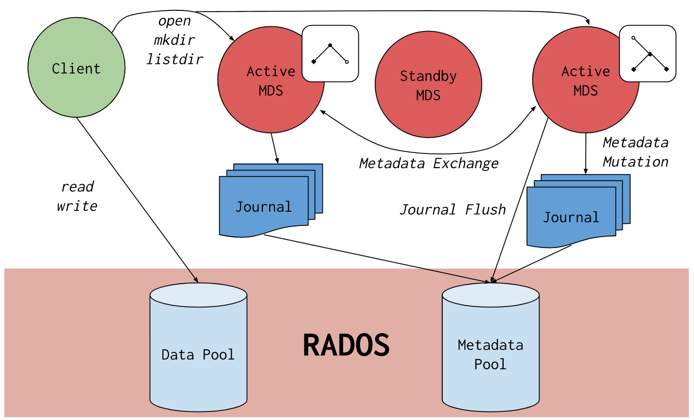
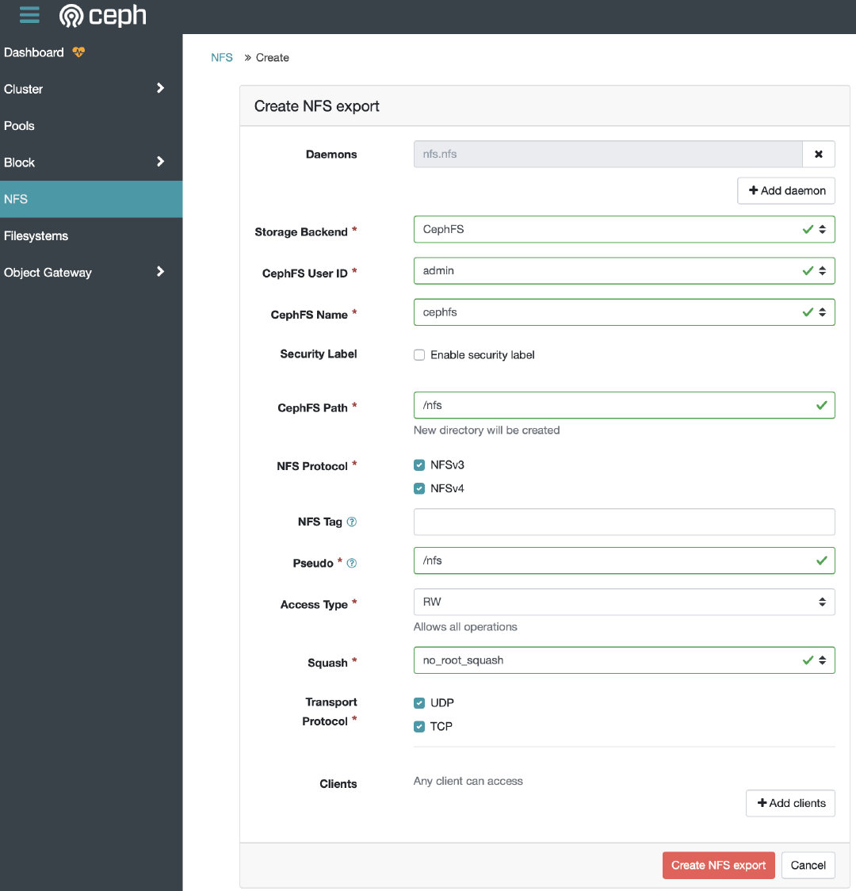

# Ceph安装

## ceph-adm安装

本文采用ceph-adm安装octopus版本的ceph。

### 主机信息

| 主机名 |             CEPH组件             |     ip     |
| ------ | :------------------------------: | :--------: |
| ceph-1 | cephadm,osd, mon, mgr,crash, rgw | 10.1.19.35 |
| ceph-2 |     osd, mon, mgr,crash,rgw      | 10.1.19.36 |
| ceph-3 |       osd, mon, crash,rgw        | 10.1.19.37 |

### 修改主机名

```shell
hostnamectl set-hostname ceph-1
```

### 添加主机名解析

```shell
cat >> /etc/hosts <<EOF
10.1.19.35 ceph-1
10.1.19.36 ceph-2
10.1.19.37 ceph-3
EOF
```

### 配置时钟同步

```shell
vim /etc/chrony.conf    #编辑修改Chrony配置文件
 
# These servers were defined in the installation:
#server 0.centos.pool.ntp.org iburst
#server 1.centos.pool.ntp.org iburst
#server 2.centos.pool.ntp.org iburst
#server 3.centos.pool.ntp.org iburst
server ntp.aliyum.com iburst    #注释以上四行并重新配置公网NTP时间服务器地址
 
# Allow NTP client access from local network.
#allow 192.168.0.0/16
allow 10.1.19.0/24    #复制以上一行并根据实际情况配置允许内网访问此服务器同步时间的客户端网段地址

#第一节点的时间服务器地址指向的是公网地址，其它节点的时间服务器地址指向的是第一节点的IP地址；只有第一节点需要配置允许内网，其它节点无需配置；
```

```shell
systemctl restart chronyd.service #重启Chrony时间服务使配置生效（其它节点同样操作）
systemctl status chronyd.service #查看Chrony服务状态确保服务运行正常
chronyc sources    #查看跟公网时间服务器通讯状态（S列符号为星号即代表通讯正常）
chronyc clients    #查看跟其它节点时间客户端通讯状态（Hostname列有客户端信息即代表通讯正常）
```

### 安装python3

```shell
yum install -y python3
```

### 安装docker

```shell
yum install -y yum-utils device-mapper-persistent-data lvm2
yum-config-manager --add-repo http://mirrors.aliyun.com/docker-ce/linux/centos/docker-ce.repo
yum install docker-ce -y
systemctl start docker && systemctl enable docker

curl -sSL https://get.daocloud.io/daotools/set_mirror.sh | sh -s http://f1361db2.m.daocloud.io && systemctl restart docker
```

### 安装Cephadm

```shell
#下载cephadm
curl --silent --remote-name --location https://github.com/ceph/ceph/raw/octopus/src/cephadm/cephadm
#配置脚本可执行权限
chmod +x cephadm
#执行安装脚本
./cephadm add-repo --release octopus
cp /etc/yum.repos.d/ceph.repo{,.bak}    备份镜像源地址
sed -i 's#download.ceph.com#mirrors.aliyun.com/ceph#' /etc/yum.repos.d/ceph.repo    #修改镜像源为国内阿里云地址
./cephadm install
```

### Ceph集群部署

#### 引导创建集群

```shell
[root@ceph-1 ceph-install]# cephadm bootstrap --mon-ip 10.1.19.35
Creating directory /etc/ceph for ceph.conf
Verifying podman|docker is present...
Verifying lvm2 is present...
Verifying time synchronization is in place...
Unit chronyd.service is enabled and running
Repeating the final host check...
podman|docker (/usr/bin/docker) is present
systemctl is present
lvcreate is present
Unit chronyd.service is enabled and running
Host looks OK
Cluster fsid: ef919e2a-04aa-11ec-a109-005056b159dc
Verifying IP 10.1.19.35 port 3300 ...
Verifying IP 10.1.19.35 port 6789 ...
Mon IP 10.1.19.35 is in CIDR network 10.1.0.0/16
Pulling container image docker.io/ceph/ceph:v15...
Extracting ceph user uid/gid from container image...
Creating initial keys...
Creating initial monmap...
Creating mon...
Waiting for mon to start...
Waiting for mon...
mon is available
Assimilating anything we can from ceph.conf...
Generating new minimal ceph.conf...
Restarting the monitor...
Setting mon public_network...
Creating mgr...
Verifying port 9283 ...
Wrote keyring to /etc/ceph/ceph.client.admin.keyring
Wrote config to /etc/ceph/ceph.conf
Waiting for mgr to start...
Waiting for mgr...
mgr not available, waiting (1/10)...
mgr not available, waiting (2/10)...
mgr not available, waiting (3/10)...
mgr not available, waiting (4/10)...
mgr not available, waiting (5/10)...
mgr is available
Enabling cephadm module...
Waiting for the mgr to restart...
Waiting for Mgr epoch 5...
Mgr epoch 5 is available
Setting orchestrator backend to cephadm...
Generating ssh key...
Wrote public SSH key to to /etc/ceph/ceph.pub
Adding key to root@localhost's authorized_keys...
Adding host ceph-1...
Deploying mon service with default placement...
Deploying mgr service with default placement...
Deploying crash service with default placement...
Enabling mgr prometheus module...
Deploying prometheus service with default placement...
Deploying grafana service with default placement...
Deploying node-exporter service with default placement...
Deploying alertmanager service with default placement...
Enabling the dashboard module...
Waiting for the mgr to restart...
Waiting for Mgr epoch 13...
Mgr epoch 13 is available
Generating a dashboard self-signed certificate...
Creating initial admin user...
Fetching dashboard port number...
Ceph Dashboard is now available at:

             URL: https://ceph-1:8443/
            User: admin
        Password: zfbt99m1f1

You can access the Ceph CLI with:

        sudo /usr/sbin/cephadm shell --fsid ef919e2a-04aa-11ec-a109-005056b159dc -c /etc/ceph/ceph.conf -k /etc/ceph/ceph.client.admin.keyring

Please consider enabling telemetry to help improve Ceph:

        ceph telemetry on

For more information see:

        https://docs.ceph.com/docs/master/mgr/telemetry/

Bootstrap complete.
```

PS：该命令执行以下操作：
    1、在本地主机上为新集群创建monitor 和 manager daemon守护程序。
    2、为Ceph集群生成一个新的SSH密钥，并将其添加到root用户的/root/.ssh/authorized_keys文件中。
    3、将与新群集进行通信所需的最小配置文件保存到/etc/ceph/ceph.conf。
    4、向/etc/ceph/ceph.client.admin.keyring写入client.admin管理（特权！）secret key的副本。
    5、将public key的副本写入/etc/ceph/ceph.pub。

#### 查看当前配置文件

```shell
[root@ceph-1 ceph-install]# ll /etc/ceph/
总用量 12
-rw-------. 1 root root  63 8月  24 15:40 ceph.client.admin.keyring
-rw-r--r--. 1 root root 171 8月  24 15:40 ceph.conf
-rw-r--r--. 1 root root 595 8月  24 15:40 ceph.pub
```

#### 查看当前拉取的镜像及容器运行状态

```shell
[root@ceph-1 ~]# docker image ls
REPOSITORY           TAG       IMAGE ID       CREATED         SIZE
ceph/ceph-grafana    6.7.4     557c83e11646   2 weeks ago     486MB
ceph/ceph            v15       2cf504fded39   2 months ago    1.03GB
prom/prometheus      v2.18.1   de242295e225   15 months ago   140MB
prom/alertmanager    v0.20.0   0881eb8f169f   20 months ago   52.1MB
prom/node-exporter   v0.18.1   e5a616e4b9cf   2 years ago     22.9MB
[root@ceph-1 ceph-install]# docker container ls
CONTAINER ID   IMAGE                        COMMAND                  CREATED          STATUS          PORTS      NAMES
bc9863e97456   prom/node-exporter:v0.18.1   "/bin/node_exporter"     7 seconds ago    Up 7 seconds    9100/tcp   adoring_snyder
914e1c6df303   ceph/ceph-grafana:6.7.4      "/bin/sh -c 'grafana…"   22 minutes ago   Up 22 minutes              ceph-861850c4-04b4-11ec-a1ea-005056b159dc-grafana.ceph-1
df7d965f65b9   prom/alertmanager:v0.20.0    "/bin/alertmanager -…"   22 minutes ago   Up 22 minutes              ceph-861850c4-04b4-11ec-a1ea-005056b159dc-alertmanager.ceph-1
0fca0882ee5c   prom/prometheus:v2.18.1      "/bin/prometheus --c…"   22 minutes ago   Up 22 minutes              ceph-861850c4-04b4-11ec-a1ea-005056b159dc-prometheus.ceph-1
28aa5c81078d   ceph/ceph:v15                "/usr/bin/ceph-crash…"   22 minutes ago   Up 22 minutes              ceph-861850c4-04b4-11ec-a1ea-005056b159dc-crash.ceph-1
51a690547ba8   ceph/ceph:v15                "/usr/bin/ceph-mgr -…"   23 minutes ago   Up 23 minutes              ceph-861850c4-04b4-11ec-a1ea-005056b159dc-mgr.ceph-1.ukmxmx
07d7224eea9f   ceph/ceph:v15                "/usr/bin/ceph-mon -…"   23 minutes ago   Up 23 minutes              ceph-861850c4-04b4-11ec-a1ea-005056b159dc-mon.ceph-1
```

根据初始化完成的提示使用浏览器访问Dashboard([https://ceph1-IP:8443](https://www.ityww.cn/go?url=https://ceph1-IP:8443))，修改密码后登录到Ceph Dashboard；还有一个实时显示Ceph集群状态的检测页面Grafana（https://ceph1-IP:3000）

#### 启用CEPH命令

```shell
[root@ceph-1 ceph]# cephadm shell
Inferring fsid 861850c4-04b4-11ec-a1ea-005056b159dc
Inferring config /var/lib/ceph/861850c4-04b4-11ec-a1ea-005056b159dc/mon.ceph-1/config
Using recent ceph image ceph/ceph@sha256:056637972a107df4096f10951e4216b21fcd8ae0b9fb4552e628d35df3f61139
[ceph: root@ceph-1 /]# ceph -s
  cluster:
    id:     861850c4-04b4-11ec-a1ea-005056b159dc
    health: HEALTH_WARN
            OSD count 0 < osd_pool_default_size 3
 
  services:
    mon: 1 daemons, quorum ceph-1 (age 29m)
    mgr: ceph-1.ukmxmx(active, since 28m)
    osd: 0 osds: 0 up, 0 in
 
  data:
    pools:   0 pools, 0 pgs
    objects: 0 objects, 0 B
    usage:   0 B used, 0 B / 0 B avail
    pgs:     
```

安装ceph-common包使本地主机支持ceph基本命令

```shell
[root@ceph-1 ceph]# cephadm install ceph-common
Installing packages ['ceph-common']...
[root@ceph-1 ceph]# ceph -s
  cluster:
    id:     861850c4-04b4-11ec-a1ea-005056b159dc
    health: HEALTH_WARN
            OSD count 0 < osd_pool_default_size 3
 
  services:
    mon: 1 daemons, quorum ceph-1 (age 35m)
    mgr: ceph-1.ukmxmx(active, since 35m)
    osd: 0 osds: 0 up, 0 in
 
  data:
    pools:   0 pools, 0 pgs
    objects: 0 objects, 0 B
    usage:   0 B used, 0 B / 0 B avail
    pgs:     
```

#### 将主机添加到集群中

配置集群的公共SSH公钥至其它Ceph节点

```shell
[root@ceph-1 ceph]# ssh-copy-id -f -i /etc/ceph/ceph.pub root@ceph-2
/usr/bin/ssh-copy-id: INFO: Source of key(s) to be installed: "/etc/ceph/ceph.pub"
The authenticity of host 'ceph-2 (10.1.19.36)' can't be established.
ECDSA key fingerprint is SHA256:jnnkuADssMxyuv2kFLwDm+OJEzE3A9w8/3HDAjGphHw.
ECDSA key fingerprint is MD5:b9:7d:37:f3:49:7d:b3:55:4d:e7:a3:e0:2e:33:37:a7.
Are you sure you want to continue connecting (yes/no)? yes
root@ceph-2's password: 

Number of key(s) added: 1

Now try logging into the machine, with:   "ssh 'root@ceph-2'"
and check to make sure that only the key(s) you wanted were added.

[root@ceph-1 ceph]# ssh-copy-id -f -i /etc/ceph/ceph.pub root@ceph-3
/usr/bin/ssh-copy-id: INFO: Source of key(s) to be installed: "/etc/ceph/ceph.pub"
The authenticity of host 'ceph-3 (10.1.19.37)' can't be established.
ECDSA key fingerprint is SHA256:jnnkuADssMxyuv2kFLwDm+OJEzE3A9w8/3HDAjGphHw.
ECDSA key fingerprint is MD5:b9:7d:37:f3:49:7d:b3:55:4d:e7:a3:e0:2e:33:37:a7.
Are you sure you want to continue connecting (yes/no)? yes
root@ceph-3's password: 

Number of key(s) added: 1

Now try logging into the machine, with:   "ssh 'root@ceph-3'"
and check to make sure that only the key(s) you wanted were added.
```

添加指定新节点加入Ceph集群中

```shell
ceph orch host add ceph-2
ceph orch host add ceph-3
ceph orch host ls    #验证查看ceph纳管的所有节点
```

添加完成后ceph会自动扩展monitor和manager到另外节点(此过程时间可能会稍久，耐心等待)，另外可用命令(ceph -s)或Ceph的Ceph Dashboard页面查看添加情况

```shell
[root@ceph-1 ~]# ceph -s
  cluster:
    id:     861850c4-04b4-11ec-a1ea-005056b159dc
    health: HEALTH_WARN
            OSD count 0 < osd_pool_default_size 3
 
  services:
    mon: 3 daemons, quorum ceph-1,ceph-2,ceph-3 (age 8m)
    mgr: ceph-1.ukmxmx(active, since 17h), standbys: ceph-2.voouip
    osd: 0 osds: 0 up, 0 in
 
  data:
    pools:   0 pools, 0 pgs
    objects: 0 objects, 0 B
    usage:   0 B used, 0 B / 0 B avail
    pgs:     
```

#### 部署osd

1.自动使用任何可用和未使用的存储设备

```shell
ceph orch apply osd –all-available-devices
```

2.手工添加

```shell
[root@ceph-1 ~]# lsblk
NAME            MAJ:MIN RM  SIZE RO TYPE MOUNTPOINT
sda               8:0    0   15T  0 disk 
├─sda1            8:1    0    1M  0 part 
├─sda2            8:2    0    1G  0 part /boot
└─sda3            8:3    0   15T  0 part 
  ├─centos-root 253:0    0   50G  0 lvm  /
  ├─centos-swap 253:1    0 31.5G  0 lvm  [SWAP]
  └─centos-home 253:2    0 14.9T  0 lvm  /home
sdb               8:16   0    3T  0 disk 
sdc               8:32   0    3T  0 disk 
sdd               8:48   0    3T  0 disk 
sde               8:64   0    3T  0 disk 
sdf               8:80   0    3T  0 disk 
sr0              11:0    1 1024M  0 rom 
#确定后执行命令添加
ceph orch daemon add osd ceph-1:/dev/sdb
ceph orch daemon add osd ceph-1:/dev/sdc
ceph orch daemon add osd ceph-1:/dev/sdd
ceph orch daemon add osd ceph-1:/dev/sde
ceph orch daemon add osd ceph-1:/dev/sdf
ceph orch daemon add osd ceph-2:/dev/sdb
ceph orch daemon add osd ceph-2:/dev/sdc
ceph orch daemon add osd ceph-2:/dev/sdd
ceph orch daemon add osd ceph-2:/dev/sde
ceph orch daemon add osd ceph-2:/dev/sdf
ceph orch daemon add osd ceph-3:/dev/sdb
ceph orch daemon add osd ceph-3:/dev/sdc
ceph orch daemon add osd ceph-3:/dev/sdd
ceph orch daemon add osd ceph-3:/dev/sde
ceph orch daemon add osd ceph-3:/dev/sdf
#验证
[root@ceph-1 ~]# ceph -s
  cluster:
    id:     861850c4-04b4-11ec-a1ea-005056b159dc
    health: HEALTH_OK
 
  services:
    mon: 3 daemons, quorum ceph-1,ceph-2,ceph-3 (age 30m)
    mgr: ceph-1.ukmxmx(active, since 17h), standbys: ceph-2.voouip
    osd: 15 osds: 15 up (since 10m), 15 in (since 10m)
 
  data:
    pools:   1 pools, 1 pgs
    objects: 0 objects, 0 B
    usage:   15 GiB used, 45 TiB / 45 TiB avail
    pgs:     1 active+clean
```

### 部署RGWS

```shell
#如果尚未创建领域，请首先创建一个领域：
radosgw-admin realm create --rgw-realm=test --default

#接下来创建一个新的区域组：
radosgw-admin zonegroup create --rgw-zonegroup=cn-north --master --default

#接下来创建一个区域：
radosgw-admin zone create --rgw-zonegroup=cn-north --rgw-zone=beijing --master --default

#为特定领域和区域部署一组radosgw守护程序：
ceph orch apply rgw test beijing --placement="3 ceph-1 ceph-2 ceph-3"
```

```shell
[root@ceph-1 ~]# ceph orch ls | grep rgw
rgw.test.beijing      3/3  52s ago    55s  ceph-1;ceph-2;ceph-3;count:3  docker.io/ceph/ceph:v15               2cf504fded39 
```

默认rgw服务都启动在80端口。

#### 高可用RGW

可通过keepalived+haproxy实现，此处不再赘述。

#### 配置界面查看RGW

```shell
[root@ceph-1 ceph-install]# radosgw-admin user create --uid=dashboard --display-name=dashboard --system
{
    "user_id": "dashboard",
    "display_name": "dashboard",
    "email": "",
    "suspended": 0,
    "max_buckets": 1000,
    "subusers": [],
    "keys": [
        {
            "user": "dashboard",
            "access_key": "SLF5CK1DEHB5FLIR16Y8",
            "secret_key": "nuZzGy6PmgxZ8bXXjDOcRGbNIS7evEwXYlJ0xT6F"
        }
    ],
    "swift_keys": [],
    "caps": [],
    "op_mask": "read, write, delete",
    "system": "true",
    "default_placement": "",
    "default_storage_class": "",
    "placement_tags": [],
    "bucket_quota": {
        "enabled": false,
        "check_on_raw": false,
        "max_size": -1,
        "max_size_kb": 0,
        "max_objects": -1
    },
    "user_quota": {
        "enabled": false,
        "check_on_raw": false,
        "max_size": -1,
        "max_size_kb": 0,
        "max_objects": -1
    },
    "temp_url_keys": [],
    "type": "rgw",
    "mfa_ids": []
}
```

```shell
ceph dashboard set-rgw-api-access-key "SLF5CK1DEHB5FLIR16Y8"
ceph dashboard set-rgw-api-secret-key "nuZzGy6PmgxZ8bXXjDOcRGbNIS7evEwXYlJ0xT6F"
ceph dashboard set-rgw-api-ssl-verify False
```

### 部署Cephfs



CephFS底层是基于RADOS的，具体来说是基于RADOS上的两个存储池，一个用来存储文件，一个用来存储文件的元数据。所以，诸如文件的目录结构等信息都是在元数据存储池里的，因此，如果有SSD，建议把元数据的存储池放在SSD上，一方面加速，另一方面，元数据的体积并不会特别大。而文件数据存储池应该放在HDD上。

#### 创建Cephfs

```shell
ceph fs volume create cephfs --placement="3 ceph-1 ceph-2 ceph-3"

[root@ceph-1 ~]# ceph fs ls
name: cephfs, metadata pool: cephfs.cephfs.meta, data pools: [cephfs.cephfs.data ]
```

#### 挂载目录

```shell
mkdir /mnt/cephfs
#mount -t ceph <monitor-ip>:6789:/ /mnt/cephfs/ -o name=admin,secret=<admin-key>
mount -t ceph 10.1.19.35:6789:/ /mnt/cephfs/ -o name=admin,secret=AQB0rCRh+BThNhAAE8Qh+0I8OvgFVoUT8Y+EiA==
```

### 部署NFS

Ceph推荐使用NFS-ganesha来提供NFS服务。

```shell
#创建存储池nfs-ganesha
ceph osd pool create nfs-ganesha 512 512
#利用cephadm部署NFS服务
ceph orch apply nfs nfs nfs-ganesha nfs-ns --placement="3 ceph-1 ceph-2 ceph-3"
ceph osd pool application enable nfs-ganesha nfs
#为了在dashboard中进行操作，可以进行如下设置：
ceph dashboard set-ganesha-clusters-rados-pool-namespace nfs-ganesha/nfs-ns
```

```shell
#前一步骤中已经挂载了CephFS到/mnt/cephfs
mkdir /mnt/cephfs/nfs
```

最后，在dashboard中创建一个NFS即可：




参考文章：

https://docs.ceph.com/en/latest/cephadm/

https://www.ityww.cn/1588.html

https://blog.csdn.net/get_set/article/details/108092248
