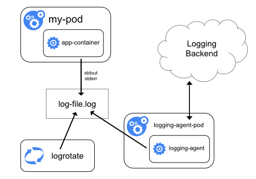

# ELK安装

## ELK架构

本文采用在Node上部署logging agent方式采集k8s集群日志。



同时采用Filebeat作为数据采集客户端，Kafka作为数据缓冲队列，Logstash拉取消息队列数据并进行数据过滤分析，接着将格式化后的数据传递给Elasticsearch进行存储。最后，由Kibana将日志和数据呈现给用户。


## ElasticSearch安装

### 添加ElasticSearch仓库

```shell
helm repo add elastic https://helm.elastic.co
```

### 拉取ElasticSearch的chart文件

```shell
helm pull elastic/elasticsearch
```

### 下载镜像

```shell
docker pull docker.elastic.co/elasticsearch/elasticsearch:7.14.0
```

### 创建集群证书

ElasticSearch 7.x 版本默认安装了 `X-Pack` 插件，并且部分功能免费，这里我们配置安全证书文件。

#### 生成证书文件

```shell
# 运行容器生成证书
docker run --name elastic-charts-certs -i -w /app elasticsearch:7.14.0 /bin/sh -c  \
  "elasticsearch-certutil ca --out /app/elastic-stack-ca.p12 --pass '' && \
    elasticsearch-certutil cert --name security-master --dns \
    security-master --ca /app/elastic-stack-ca.p12 --pass '' --ca-pass '' --out /app/elastic-certificates.p12"

# 从容器中将生成的证书拷贝出来
docker cp elastic-charts-certs:/app/elastic-certificates.p12 ./ 

# 删除容器
docker rm -f elastic-charts-certs

# 将 pcks12 中的信息分离出来，写入文件
openssl pkcs12 -nodes -passin pass:'' -in elastic-certificates.p12 -out elastic-certificate.pem
```

#### 添加证书

```shell
# 添加证书
kubectl create secret generic elastic-certificates --from-file=elastic-certificates.p12 -n elk
kubectl create secret generic elastic-certificate-pem --from-file=elastic-certificate.pem -n elk

# 设置集群用户名密码，用户名不建议修改
kubectl create secret generic elastic-credentials \
  --from-literal=username=elastic --from-literal=password=admin@123 -n elk
```

### 创建ElasticSearch安装配置文件

es-master-values.yaml：

```yaml
# ============设置集群名称============
## 设置集群名称
clusterName: "elasticsearch"
## 设置节点名称
nodeGroup: "master"
## 设置角色
roles:
  master: "true"
  ingest: "false"
  data: "false"
# ============镜像配置============
## 指定镜像与镜像版本
image: "docker.elastic.co/elasticsearch/elasticsearch"
imageTag: "7.14.0"
## 副本数
replicas: 3
# ============资源配置============
## JVM 配置参数
esJavaOpts: "-Xmx1g -Xms1g"
## 部署资源配置(生成环境一定要设置大些)
resources:
  requests:
    cpu: "2000m"
    memory: "2Gi"
  limits:
    cpu: "2000m"
    memory: "2Gi"
## 数据持久卷配置
persistence:
  enabled: true
## 存储数据大小配置
volumeClaimTemplate:
  storageClassName: csi-rbd-sc
  accessModes: [ "ReadWriteOnce" ]
  resources:
    requests:
      storage: 5Gi
# ============安全配置============
## 设置协议，可配置为 http、https
protocol: http
## 证书挂载配置，这里我们挂入上面创建的证书
secretMounts:
  - name: elastic-certificates
    secretName: elastic-certificates
    path: /usr/share/elasticsearch/config/certs
## 允许您在/usr/share/elasticsearch/config/中添加任何自定义配置文件,例如 elasticsearch.yml
## ElasticSearch 7.x 默认安装了 x-pack 插件，部分功能免费，这里我们配置下
## 下面注掉的部分为配置 https 证书，配置此部分还需要配置 helm 参数 protocol 值改为 https
esConfig:
  elasticsearch.yml: |
    xpack.security.enabled: true
    xpack.security.transport.ssl.enabled: true
    xpack.security.transport.ssl.verification_mode: certificate
    xpack.security.transport.ssl.keystore.path: /usr/share/elasticsearch/config/certs/elastic-certificates.p12
    xpack.security.transport.ssl.truststore.path: /usr/share/elasticsearch/config/certs/elastic-certificates.p12
    # xpack.security.http.ssl.enabled: true
    # xpack.security.http.ssl.truststore.path: /usr/share/elasticsearch/config/certs/elastic-certificates.p12
    # xpack.security.http.ssl.keystore.path: /usr/share/elasticsearch/config/certs/elastic-certificates.p12
## 环境变量配置，这里引入上面设置的用户名、密码 secret 文件
extraEnvs:
  - name: ELASTIC_USERNAME
    valueFrom:
      secretKeyRef:
        name: elastic-credentials
        key: username
  - name: ELASTIC_PASSWORD
    valueFrom:
      secretKeyRef:
        name: elastic-credentials
        key: password
# ============调度配置============
## 设置调度策略
## - hard：只有当有足够的节点时 Pod 才会被调度，并且它们永远不会出现在同一个节点上
## - soft：尽最大努力调度
antiAffinity: "hard"
## 容忍配置（一般 kubernetes master 或其它设置污点的节点，只有指定容忍才能进行调度，如果测试环境只有三个节点，则可以开启在 master 节点安装应用）
#tolerations:
#  - operator: "Exists"  ##容忍全部污点
```

es-data-values.yaml

```yaml
# ============设置集群名称============
## 设置集群名称
clusterName: "elasticsearch"
## 设置节点名称
nodeGroup: "data"
## 设置角色
roles:
  master: "false"
  ingest: "true"
  data: "true"

# ============镜像配置============
## 指定镜像与镜像版本
image: "docker.elastic.co/elasticsearch/elasticsearch"
imageTag: "7.14.0"
## 副本数
replicas: 3

# ============资源配置============
## JVM 配置参数
esJavaOpts: "-Xmx1g -Xms1g"
## 部署资源配置(生成环境一定要设置大些)
resources:
  requests:
    cpu: "1000m"
    memory: "2Gi"
  limits:
    cpu: "1000m"
    memory: "2Gi"
## 数据持久卷配置
persistence:
  enabled: true
## 存储数据大小配置
volumeClaimTemplate:
  storageClassName: csi-rbd-sc
  accessModes: [ "ReadWriteOnce" ]
  resources:
    requests:
      storage: 50Gi

# ============安全配置============
## 设置协议，可配置为 http、https
protocol: http
## 证书挂载配置，这里我们挂入上面创建的证书
secretMounts:
  - name: elastic-certificates
    secretName: elastic-certificates
    path: /usr/share/elasticsearch/config/certs
## 允许您在/usr/share/elasticsearch/config/中添加任何自定义配置文件,例如 elasticsearch.yml
## ElasticSearch 7.x 默认安装了 x-pack 插件，部分功能免费，这里我们配置下
## 下面注掉的部分为配置 https 证书，配置此部分还需要配置 helm 参数 protocol 值改为 https
esConfig:
  elasticsearch.yml: |
    xpack.security.enabled: true
    xpack.security.transport.ssl.enabled: true
    xpack.security.transport.ssl.verification_mode: certificate
    xpack.security.transport.ssl.keystore.path: /usr/share/elasticsearch/config/certs/elastic-certificates.p12
    xpack.security.transport.ssl.truststore.path: /usr/share/elasticsearch/config/certs/elastic-certificates.p12
    # xpack.security.http.ssl.enabled: true
    # xpack.security.http.ssl.truststore.path: /usr/share/elasticsearch/config/certs/elastic-certificates.p12
    # xpack.security.http.ssl.keystore.path: /usr/share/elasticsearch/config/certs/elastic-certificates.p12
## 环境变量配置，这里引入上面设置的用户名、密码 secret 文件
extraEnvs:
  - name: ELASTIC_USERNAME
    valueFrom:
      secretKeyRef:
        name: elastic-credentials
        key: username
  - name: ELASTIC_PASSWORD
    valueFrom:
      secretKeyRef:
        name: elastic-credentials
        key: password

# ============调度配置============
## 设置调度策略
## - hard：只有当有足够的节点时 Pod 才会被调度，并且它们永远不会出现在同一个节点上
## - soft：尽最大努力调度
antiAffinity: "hard"
## 容忍配置（一般 kubernetes master 或其它设置污点的节点，只有指定容忍才能进行调度，如果测试环境只有三个节点，则可以开启在 master 节点安装应用）
#tolerations: 
#  - operator: "Exists"  ##容忍全部污点
```

es-client-values.yaml

```yaml
# ============设置集群名称============
## 设置集群名称
clusterName: "elasticsearch"
## 设置节点名称
nodeGroup: "client"
## 设置角色
roles:
  master: "false"
  ingest: "false"
  data: "false"
# ============镜像配置============
## 指定镜像与镜像版本
image: "docker.elastic.co/elasticsearch/elasticsearch"
imageTag: "7.14.0"
## 副本数
replicas: 2
# ============资源配置============
## JVM 配置参数
esJavaOpts: "-Xmx1g -Xms1g"
## 部署资源配置(生成环境一定要设置大些)
resources:
  requests:
    cpu: "1000m"
    memory: "2Gi"
  limits:
    cpu: "1000m"
    memory: "2Gi"
## 数据持久卷配置
persistence:
  enabled: false
# ============安全配置============
## 设置协议，可配置为 http、https
protocol: http
## 证书挂载配置，这里我们挂入上面创建的证书
secretMounts:
  - name: elastic-certificates
    secretName: elastic-certificates
    path: /usr/share/elasticsearch/config/certs
## 允许您在/usr/share/elasticsearch/config/中添加任何自定义配置文件,例如 elasticsearch.yml
## ElasticSearch 7.x 默认安装了 x-pack 插件，部分功能免费，这里我们配置下
## 下面注掉的部分为配置 https 证书，配置此部分还需要配置 helm 参数 protocol 值改为 https
esConfig:
  elasticsearch.yml: |
    xpack.security.enabled: true
    xpack.security.transport.ssl.enabled: true
    xpack.security.transport.ssl.verification_mode: certificate
    xpack.security.transport.ssl.keystore.path: /usr/share/elasticsearch/config/certs/elastic-certificates.p12
    xpack.security.transport.ssl.truststore.path: /usr/share/elasticsearch/config/certs/elastic-certificates.p12
    # xpack.security.http.ssl.enabled: true
    # xpack.security.http.ssl.truststore.path: /usr/share/elasticsearch/config/certs/elastic-certificates.p12
    # xpack.security.http.ssl.keystore.path: /usr/share/elasticsearch/config/certs/elastic-certificates.p12
## 环境变量配置，这里引入上面设置的用户名、密码 secret 文件
extraEnvs:
  - name: ELASTIC_USERNAME
    valueFrom:
      secretKeyRef:
        name: elastic-credentials
        key: username
  - name: ELASTIC_PASSWORD
    valueFrom:
      secretKeyRef:
        name: elastic-credentials
        key: password
# ============Ingress 配置============
ingress:
  enabled: true
  annotations:
    kubernetes.io/ingress.class: nginx
    # kubernetes.io/tls-acme: "true"
  hosts:
    - host: elasticsearch.zznode.com
      paths:
        - path: /
  tls: []
```

### 安装ElasticSearch

```shell
helm install elasticsearch-master -f es-master-values.yaml ./elasticsearch -n elk
helm install elasticsearch-data -f es-data-values.yaml ./elasticsearch -n elk
helm install elasticsearch-client -f es-client-values.yaml ./elasticsearch -n elk
```

### 测试

```shell
[root@master-1 elk]# curl -u elastic:admin@123 http://10.244.2.5:9200
{
  "name" : "elasticsearch-client-0",
  "cluster_name" : "elasticsearch",
  "cluster_uuid" : "DhSd0uO-TxaCHzbLsT9g9g",
  "version" : {
    "number" : "7.14.0",
    "build_flavor" : "default",
    "build_type" : "docker",
    "build_hash" : "dd5a0a2acaa2045ff9624f3729fc8a6f40835aa1",
    "build_date" : "2021-07-29T20:49:32.864135063Z",
    "build_snapshot" : false,
    "lucene_version" : "8.9.0",
    "minimum_wire_compatibility_version" : "6.8.0",
    "minimum_index_compatibility_version" : "6.0.0-beta1"
  },
  "tagline" : "You Know, for Search"
}
```

## Logstash安装

### 拉取Logstash的chart文件

```shell
helm pull elastic/logstash
```

### 创建Logstash安装配置文件

```yaml
---
# 副本数
replicas: 3

# 控制logstash运行时的状态
logstashConfig: 
  logstash.yml: |
    http.host: "0.0.0.0"
    xpack.monitoring.elasticsearch.hosts: [ "http://elasticsearch-client:9200" ]
    xpack.monitoring.elasticsearch.username: "elastic"
    xpack.monitoring.elasticsearch.password: "admin@123" 

# 管道的配置文件
logstashPipeline:
  logstash.conf: |
    input {
      #从kafka集群消费消息
      kafka {
        #对应Kafka的Topic
        topics => ["kube-system","ceph","kube-ops","ingress-nginx","elk","kuboard"]
        #Kafka消费者组名称
        group_id => "k8s-log"
        consumer_threads => 3
        auto_offset_reset => "latest"
        #Kafka地址
        bootstrap_servers => "kafka:9092"
        codec => "json"
        #添加自定义属性
        add_field => {"type" => "system"}
      }
      #kafka {
      #  topics => ["devopsV4-zznode"]
      #  group_id => "devopsV4"
      #  #当消息相同源Kafka的消息时，需要配置client_id，不然就会采用默认id logstash，发生冲突
      #  client_id => "devopsV4"
      #  consumer_threads => 3
      #  auto_offset_reset => "latest"
      #  bootstrap_servers => "kafka:9092"
      #  codec => "json"
      #  add_field => {"type" => "devopsV4"}
      #}
    }
    
    filter {
      if [type] == "devopsV4" {
        grok {
          match => { "message" => "%{TIMESTAMP_ISO8601:datetime}[\s]*%{LOGLEVEL:level}\s*[0-9]?\s*\-*\s*\[?(?<thread>[a-zA-Z0-9\-]*)\]?\s*(?<class>[a-zA-Z0-9\.]*)\s*\:?%{GREEDYDATA:message}|%{GREEDYDATA:message}" }
          overwrite => [ "message" ]
        }
      }
    }
    
    output {
      if [type] == "system" {
        elasticsearch {
          #当输出到相同es时，需要添加id加以区分
          id => "system"
          #es地址
          hosts => ["elasticsearch-client:9200"]
          #es索引名称
          index => "k8s-%{[kubernetes][namespace]}-%{[kubernetes][pod][name]}-%{+YYYY.MM.dd}"
          user => "elastic"
          password => "admin@123"
        }
      }
      #if [type] == "devopsV4" {
      #  elasticsearch {
      #    id => "devopsV4"
      #    hosts => ["elasticsearch-client:9200"]
      #    #index名称必须小写
      #    index => "devopsv4-%{[kubernetes][namespace]}-%{[kubernetes][pod][name]}-%{+YYYY.MM.dd}"
      #    user => "elastic"
      #    password => "admin@123"
      #  }
      #}
    } 

extraEnvs:
  - name: ELASTIC_USERNAME
    valueFrom:
      secretKeyRef:
        name: elastic-credentials
        key: username
  - name: ELASTIC_PASSWORD
    valueFrom:
      secretKeyRef:
        name: elastic-credentials
        key: password

image: "docker.elastic.co/logstash/logstash"
imageTag: "7.14.0"
imagePullPolicy: "IfNotPresent"

# logstash 运行 jvm 设置
logstashJavaOpts: "-Xmx2g -Xms2g"

# logstash pod 资源限制
resources:
  requests:
    cpu: "100m"
    memory: "1536Mi"
  limits:
    cpu: "1000m"
    memory: "1536Mi"

persistence:
  enabled: true
  
volumeClaimTemplate:
  accessModes: [ "ReadWriteOnce" ]
  storageClassName: "csi-rbd-sc"
  resources:
    requests:
      storage: 2Gi


# service 设置
service:
  type: ClusterIP
  ports:
    - name: beats
      port: 5044
      protocol: TCP
      targetPort: 5044
#    - name: http
#      port: 8080
#      protocol: TCP
#      targetPort: 8080
```

### 安装Logstash

```shell
helm install logstash -f logstash.yaml ./logstash -n elk
```

## Kibana安装

### 拉取Kibana的chart文件

```shell
helm pull elastic/kibana
```

### 创建Kibana安装配置文件

```yaml
# ============镜像配置============
## 指定镜像与镜像版本
image: "docker.elastic.co/kibana/kibana"
imageTag: "7.14.0"
imagePullPolicy: "IfNotPresent"
## 配置 ElasticSearch 地址
elasticsearchHosts: "http://elasticsearch-client:9200"

# ============环境变量配置============
## 环境变量配置，这里引入上面设置的用户名、密码 secret 文件
extraEnvs:
  - name: ELASTICSEARCH_USERNAME
    valueFrom:
      secretKeyRef:
        name: elastic-credentials
        key: username
  - name: ELASTICSEARCH_PASSWORD
    valueFrom:
      secretKeyRef:
        name: elastic-credentials
        key: password
# ============资源配置============
resources:
  requests:
    cpu: "1000m"
    memory: "2Gi"
  limits:
    cpu: "1000m"
    memory: "2Gi"
# ============配置 Kibana 参数============
## kibana 配置中添加语言配置，设置 kibana 为中文
kibanaConfig:
  kibana.yml: |
    i18n.locale: "zh-CN"
    # elasticsearch.username: "elastic"
    # elasticsearch.password: "admin@123"
```

### 安装Kibana

```shell
helm install kibana -f kibana.yaml ./kibana -n elk
```

### 创建ingress

kibana-tls.yaml:

```yaml
apiVersion: v1
kind: Secret
metadata:
  name: kibana-tls
  namespace: elk
data:
  tls.crt: base64 编码的 cert
  tls.key: base64 编码的 key
type: kubernetes.io/tls
```

kibana-ingress.yaml:

```yaml
apiVersion: networking.k8s.io/v1
kind: Ingress
metadata:
  name: kibana
  namespace: elk
  annotations:
    kubernetes.io/ingress.class: "nginx"
spec:
  rules:
  - host: "kibana.zznode.com"
    http:
      paths:
      - pathType: Prefix
        path: "/"
        backend:
          service:
            name: kibana-kibana
            port:
              number: 5601
  tls: 
  - secretName: kibana-tls
    hosts:
      - kibana.zznode.com
```

```shell
kubectl apply -f kibana-tls.yaml
kubectl apply -f kibana-ingress.yaml
```

## Kafka安装

### 添加Kafka仓库

```shell
helm repo add bitnami https://charts.bitnami.com/bitnami
```

### 拉取Kafka的chart文件

```shell
helm fetch bitnami/kafka
```

### 创建Kafka安装配置文件

kafka.yaml:

```yaml
replicaCount: 3
persistence:
  enabled: true
  storageClass: "csi-rbd-sc"
  accessModes:
    - ReadWriteOnce
  size: "20Gi"
#externalAccess: #提供k8s集群外部访问kafka集群地址
#  enabled: true
#  service:
#    type: NodePort
#    nodePorts:
#      - 31090
#      - 31091
#      - 31092
#    domain: "10.1.19.59"
zookeeper:
  persistence:
    enabled: true
    storageClass: "csi-rbd-sc"
    accessModes:
    - ReadWriteOnce
    size: "10Gi"
  replicaCount: 3  
```

``注意修改配置文件中的配置default.replication.factor=3;num.partitions=3``

### 安装Kafka

```shell
helm install kafka -f kafka.yaml ./kafka -n elk
```

### Kafka常用命令

```shell
# 列出Topic
kubectl -n elk exec kafka-0 -- /opt/bitnami/kafka/bin/kafka-topics.sh --zookeeper kafka-zookeeper:2181 --list
# 查看Topic
kubectl -n elk exec kafka-0 -- /opt/bitnami/kafka/bin/kafka-topics.sh --zookeeper kafka-zookeeper:2181 --describe --topic kube-system
# 生产数据，推荐进入容器中执行
kubectl -n elk exec kafka-0 -- /opt/bitnami/kafka/bin/kafka-console-producer.sh --broker-list 127.0.0.1:9092 --topic kube-system
# 消费数据
kubectl -n elk exec -ti kafka-0 -- /opt/bitnami/kafka/bin/kafka-console-consumer.sh --bootstrap-server 127.0.0.1:9092 --topic kube-system --from-beginning
# 查看消费情况
kubectl -n elk exec kafka-0 -- /opt/bitnami/kafka/bin/kafka-consumer-groups.sh --bootstrap-server 127.0.0.1:9092 --group k8s-log --describe
```

## Filebeat安装

### 修改Yaml文件

```yaml
---
apiVersion: v1
kind: ConfigMap
metadata:
  name: filebeat-config
  namespace: elk
  labels:
    k8s-app: filebeat
data:
  filebeat.yml: |-
    filebeat.inputs:
    - type: container
      enabled: true
      paths:
        - /var/log/containers/*_kube-system_*.log
      #多行合并,将不是以日期开头或者[开头的行合并到上一行
      multiline.pattern: '^[0-9]{4}-[0-9]{2}-[0-9]{2}|^\['
      multiline.negate: true
      multiline.match: after
      multiline.timeout: 30
      fields:
        #自定义字段用于logstash识别k8s输入的日志
        kafka_topic: kube-system
    - type: container
      enabled: true
      paths:
        - /var/log/containers/*_ceph_*.log
      #多行合并,将不是以日期开头或者[开头的行合并到上一行
      multiline.pattern: '^[0-9]{4}-[0-9]{2}-[0-9]{2}|^\['
      multiline.negate: true
      multiline.match: after
      multiline.timeout: 30
      fields:
        #自定义字段用于logstash识别k8s输入的日志
        kafka_topic: ceph  
    - type: container
      enabled: true
      paths:
        - /var/log/containers/*_kube-ops_*.log
      #多行合并,将不是以日期开头或者[开头的行合并到上一行
      multiline.pattern: '^[0-9]{4}-[0-9]{2}-[0-9]{2}|^\['
      multiline.negate: true
      multiline.match: after
      multiline.timeout: 30
      fields:
        #自定义字段用于logstash识别k8s输入的日志
        kafka_topic: kube-ops  
    - type: container
      enabled: true
      paths:
        - /var/log/containers/*_ingress-nginx_*.log
      #多行合并,将不是以日期开头或者[开头的行合并到上一行
      multiline.pattern: '^[0-9]{4}-[0-9]{2}-[0-9]{2}|^\['
      multiline.negate: true
      multiline.match: after
      multiline.timeout: 30
      fields:
        #自定义字段用于logstash识别k8s输入的日志
        kafka_topic: ingress-nginx  
    - type: container
      enabled: true
      paths:
        - /var/log/containers/*_elk_*.log
      #多行合并,将不是以日期开头或者[开头的行合并到上一行
      multiline.pattern: '^[0-9]{4}-[0-9]{2}-[0-9]{2}|^\['
      multiline.negate: true
      multiline.match: after
      multiline.timeout: 30
      fields:
        #自定义字段用于logstash识别k8s输入的日志
        kafka_topic: elk
    - type: container
      enabled: true
      paths:
        - /var/log/containers/*_kuboard_*.log
      #多行合并,将不是以日期开头或者[开头的行合并到上一行
      multiline.pattern: '^[0-9]{4}-[0-9]{2}-[0-9]{2}|^\['
      multiline.negate: true
      multiline.match: after
      multiline.timeout: 30
      fields:
        #自定义字段用于logstash识别k8s输入的日志
        kafka_topic: kuboard        
      
    processors:
      - add_kubernetes_metadata:
          #添加k8s描述字段
          default_indexers.enabled: true
          default_matchers.enabled: true
          host: ${NODE_NAME}
          matchers:
          - logs_path:
              logs_path: "/var/log/containers/"
      - drop_fields:
          #删除的多余字段
          fields: ["host", "tags", "ecs", "log", "prospector", "agent", "input", "beat", "offset"]
          ignore_missing: true  
    
    output.kafka:
      enabled: true
      # initial brokers for reading cluster metadata
      hosts: ["kafka:9092"]
      # message topic selection + partitioning
      topic: '%{[fields.kafka_topic]}'
      partition.round_robin:
        reachable_only: true
    #output.console:
    #  pretty: true
    #logging.level: debug
---
apiVersion: apps/v1
kind: DaemonSet
metadata:
  name: filebeat
  namespace: elk
  labels:
    k8s-app: filebeat
spec:
  selector:
    matchLabels:
      k8s-app: filebeat
  template:
    metadata:
      labels:
        k8s-app: filebeat
    spec:
      serviceAccountName: filebeat
      terminationGracePeriodSeconds: 30
      hostNetwork: true
      dnsPolicy: ClusterFirstWithHostNet
      containers:
      - name: filebeat
        image: docker.elastic.co/beats/filebeat:7.14.0
        args: [
          "-c", "/etc/filebeat.yml",
          "-e",
        ]
        env:
        - name: ELASTICSEARCH_HOST
          value: elasticsearch
        - name: ELASTICSEARCH_PORT
          value: "9200"
        - name: ELASTICSEARCH_USERNAME
          value: elastic
        - name: ELASTICSEARCH_PASSWORD
          value: changeme
        - name: ELASTIC_CLOUD_ID
          value:
        - name: ELASTIC_CLOUD_AUTH
          value:
        - name: NODE_NAME
          valueFrom:
            fieldRef:
              fieldPath: spec.nodeName
        securityContext:
          runAsUser: 0
          # If using Red Hat OpenShift uncomment this:
          #privileged: true
        resources:
          limits:
            memory: 200Mi
          requests:
            cpu: 100m
            memory: 100Mi
        volumeMounts:
        - name: config
          mountPath: /etc/filebeat.yml
          readOnly: true
          subPath: filebeat.yml
        - name: data
          mountPath: /usr/share/filebeat/data
        - name: varlibdockercontainers #根据dokcer镜像目录的实际情况修改
          mountPath: /var/lib/docker/containers
          readOnly: true
        - name: varlog
          mountPath: /var/log
          readOnly: true
      volumes:
      - name: config
        configMap:
          defaultMode: 0640
          name: filebeat-config
      - name: varlibdockercontainers #根据dokcer镜像目录的实际情况修改
        hostPath:
          path: /var/lib/docker/containers
      - name: varlog
        hostPath:
          path: /var/log
      # data folder stores a registry of read status for all files, so we don't send everything again on a Filebeat pod restart
      - name: data
        hostPath:
          # When filebeat runs as non-root user, this directory needs to be writable by group (g+w).
          path: /var/lib/filebeat-data
          type: DirectoryOrCreate
---
apiVersion: rbac.authorization.k8s.io/v1
kind: ClusterRoleBinding
metadata:
  name: filebeat
subjects:
- kind: ServiceAccount
  name: filebeat
  namespace: elk
roleRef:
  kind: ClusterRole
  name: filebeat
  apiGroup: rbac.authorization.k8s.io
---
apiVersion: rbac.authorization.k8s.io/v1
kind: RoleBinding
metadata:
  name: filebeat
  namespace: elk
subjects:
  - kind: ServiceAccount
    name: filebeat
    namespace: elk
roleRef:
  kind: Role
  name: filebeat
  apiGroup: rbac.authorization.k8s.io
---
apiVersion: rbac.authorization.k8s.io/v1
kind: RoleBinding
metadata:
  name: filebeat-kubeadm-config
  namespace: elk
subjects:
  - kind: ServiceAccount
    name: filebeat
    namespace: elk
roleRef:
  kind: Role
  name: filebeat-kubeadm-config
  apiGroup: rbac.authorization.k8s.io
---
apiVersion: rbac.authorization.k8s.io/v1
kind: ClusterRole
metadata:
  name: filebeat
  labels:
    k8s-app: filebeat
rules:
- apiGroups: [""] # "" indicates the core API group
  resources:
  - namespaces
  - pods
  - nodes
  verbs:
  - get
  - watch
  - list
- apiGroups: ["apps"]
  resources:
    - replicasets
  verbs: ["get", "list", "watch"]
---
apiVersion: rbac.authorization.k8s.io/v1
kind: Role
metadata:
  name: filebeat
  # should be the namespace where filebeat is running
  namespace: elk
  labels:
    k8s-app: filebeat
rules:
  - apiGroups:
      - coordination.k8s.io
    resources:
      - leases
    verbs: ["get", "create", "update"]
---
apiVersion: rbac.authorization.k8s.io/v1
kind: Role
metadata:
  name: filebeat-kubeadm-config
  namespace: elk
  labels:
    k8s-app: filebeat
rules:
  - apiGroups: [""]
    resources:
      - configmaps
    resourceNames:
      - kubeadm-config
    verbs: ["get"]
---
apiVersion: v1
kind: ServiceAccount
metadata:
  name: filebeat
  namespace: elk
  labels:
    k8s-app: filebeat
---
```

### 安装Filebeat

```shell
kubectl apply -f filebeat.yaml 
```


参考文章：

https://github.com/elastic/beats/blob/v7.14.0/deploy/kubernetes/filebeat-kubernetes.yaml

https://blog.csdn.net/yanggd1987/article/details/108414587

https://www.elastic.co/guide/en/beats/filebeat/current/kafka-output.html

https://blog.csdn.net/zuozewei/article/details/108309357

https://www.cnblogs.com/Dev0ps/p/11259324.html

https://www.cnblogs.com/dogfei/p/14679813.html

https://github.com/bitnami/charts/tree/master/bitnami/kafka
