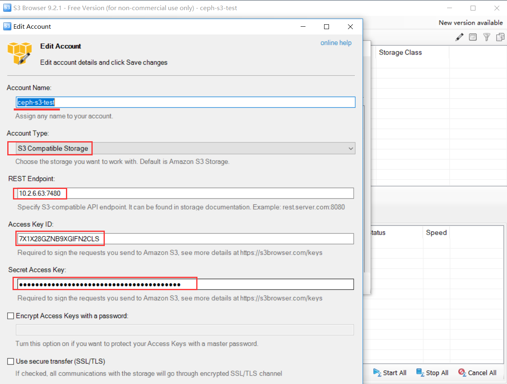
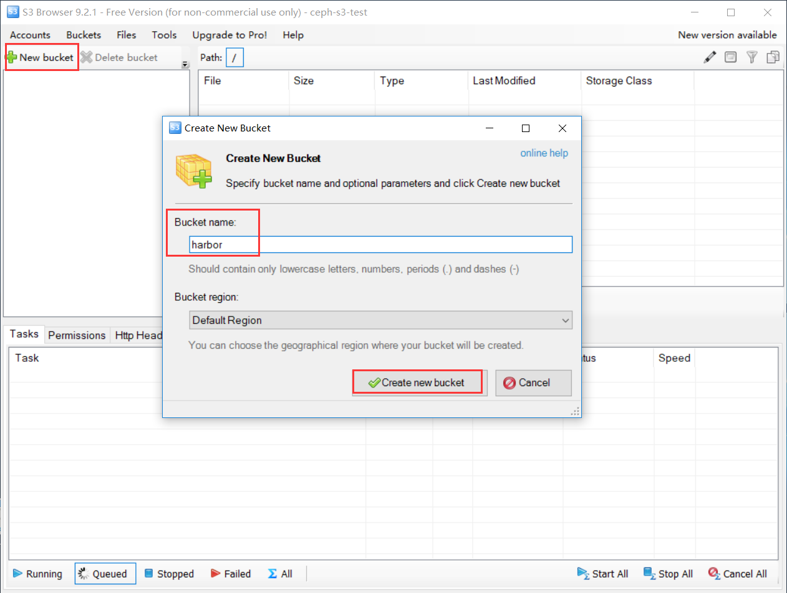

# Harbor安装

本文采用Helm3来安装Harbor，通过Ceph-csi来实现rbd与K8s的对接。


## 安装前准备
```bash
# 1. 添加仓库
helm repo add harbor https://helm.goharbor.io
# 更新
helm repo update
# pull harbor
helm pull harbor/harbor
tar -zxvf  harbor-1.7.1.tgz
```


## Ceph rbd对接K8s
### 创建 K8s pool 

通常在创建pool之前，需要覆盖默认的`pg_num`，官方推荐：

- 若少于5个OSD， 设置pg_num为128。
- 5~10个OSD，设置pg_num为512。
- 10~50个OSD，设置pg_num为4096。
- 超过50个OSD，可以参考[pgcalc](http://ceph.com/pgcalc/)计算。


```bash
# 1. 创建 k8s 资源池
ceph osd pool create kubernetes 512 512

#2.查看admin用户的key
[root@ceph-1 ~]# ceph auth get-key client.admin
AQB0rCRh+BThNhAAE8Qh+0I8OvgFVoUT8Y+EiA==
```

### 配置Ceph-csi

```shell
#1.在K8s所有节点上安装ceph-common
yum -y install ceph-common # 注意需要配置ceph的相关yum源，可以从ceph集群那台主机上面将ceph的yum源拷贝到k8s集群的所有节点上面

#2.将/etc/ceph/ceph.client.admin.keyring 复制到k8s集群的所有节点上
scp /etc/ceph/ceph.client.admin.keyring root@master-1:/etc/ceph/

#3.查看ceph fsid和监视器地址:
[root@ceph-1 ~]# ceph mon dump
dumped monmap epoch 7
epoch 7
fsid 861850c4-04b4-11ec-a1ea-005056b159dc
last_changed 2021-08-25T01:43:47.208686+0000
created 2021-08-24T08:23:17.403144+0000
min_mon_release 15 (octopus)
0: [v2:10.1.19.35:3300/0,v1:10.1.19.35:6789/0] mon.ceph-1
1: [v2:10.1.19.36:3300/0,v1:10.1.19.36:6789/0] mon.ceph-2
2: [v2:10.1.19.37:3300/0,v1:10.1.19.37:6789/0] mon.ceph-3

#4.下载ceph-csi的yaml
git clone https://github.com/ceph/ceph-csi.git
cd ceph-csi/deploy/rbd/kubernetes

#5.修改csi-config-map.yaml
---
apiVersion: v1
kind: ConfigMap
data:
  config.json: |-
    [
      {
        "clusterID": "861850c4-04b4-11ec-a1ea-005056b159dc",  #对应上面查看的fsid
        "monitors": [
          "10.1.19.35:6789",  #对应ceph-mon的地址
          "10.1.19.36:6789",
          "10.1.19.37:6789"
        ]
      }
    ]
metadata:
  name: ceph-csi-config

kubectl apply -f csi-config-map.yaml

#6.创建csi-rbd-secret.yaml
---
apiVersion: v1
kind: Secret
metadata:
  name: csi-rbd-secret
  namespace: ceph
stringData:
  userID: admin
  userKey: AQB0rCRh+BThNhAAE8Qh+0I8OvgFVoUT8Y+EiA==  #对应上面admin的key
 
kubectl apply -f csi-rbd-secret.yaml

#7.创建csi-kms-config-map.yaml
---
apiVersion: v1
kind: ConfigMap
data:
  config.json: |-
    {}
metadata:
  name: ceph-csi-encryption-kms-config
  
kubectl apply -f csi-kms-config-map.yaml

#8.安装ceph-csi插件
sed -r -i "s/namespace: [^ ]+/namespace: ceph/g" ./*.yaml
kubectl apply -f csi-provisioner-rbac.yaml
kubectl apply -f csi-nodeplugin-rbac.yaml
kubectl apply -f csi-rbdplugin-provisioner.yaml
kubectl apply -f csi-rbdplugin.yaml
```

### 创建StorageClass

```shell
cat <<EOF > csi-rbd-sc.yaml
---
apiVersion: storage.k8s.io/v1
kind: StorageClass
metadata:
   name: csi-rbd-sc
provisioner: rbd.csi.ceph.com
parameters:
   clusterID: 861850c4-04b4-11ec-a1ea-005056b159dc
   pool: kubernetes
   imageFeatures: layering
   csi.storage.k8s.io/provisioner-secret-name: csi-rbd-secret
   csi.storage.k8s.io/provisioner-secret-namespace: ceph
   csi.storage.k8s.io/controller-expand-secret-name: csi-rbd-secret
   csi.storage.k8s.io/controller-expand-secret-namespace: ceph
   csi.storage.k8s.io/node-stage-secret-name: csi-rbd-secret
   csi.storage.k8s.io/node-stage-secret-namespace: ceph
reclaimPolicy: Delete
allowVolumeExpansion: true
mountOptions:
   - discard
EOF

kubectl apply -f csi-rbd-sc.yaml
```

## Ceph RGW对接K8s

### 创建 s3 user

1. 创建 k8s 用户
```bash
radosgw-admin user create --uid="k8s" --display-name="This user to be used for k8s"

{
    "user_id": "k8s",
    "display_name": "This user to be used for k8s",
    "email": "",
    "suspended": 0,
    "max_buckets": 1000,
    "subusers": [],
    "keys": [
        {
            "user": "k8s",
            "access_key": "7X1X28GZNB9XGIFN2CLS",
            "secret_key": "ywOkr9BYSHRwzGEgB5mCJpb8QpTn4w19QNseKSAj"
        }
    ],
    "swift_keys": [],
    "caps": [],
    "op_mask": "read, write, delete",
    "default_placement": "",
    "default_storage_class": "",
    "placement_tags": [],
    "bucket_quota": {
        "enabled": false,
        "check_on_raw": false,
        "max_size": -1,
        "max_size_kb": 0,
        "max_objects": -1
    },
    "user_quota": {
        "enabled": false,
        "check_on_raw": false,
        "max_size": -1,
        "max_size_kb": 0,
        "max_objects": -1
    },
    "temp_url_keys": [],
    "type": "rgw",
    "mfa_ids": []
}

```


2. 连接 ceph (s3 方式), 并创建 bucket (harbor)






## Cephfs对接K8s

#### 配置Ceph-csi

```shell
cd ceph-csi/deploy/cephfs/kubernetes
#1.创建csi-cephfs-secret.yaml
---
apiVersion: v1
kind: Secret
metadata:
  name: csi-cephfs-secret
  namespace: ceph
stringData:
  # Required for statically provisioned volumes
  userID: admin
  userKey: AQB0rCRh+BThNhAAE8Qh+0I8OvgFVoUT8Y+EiA==

  # Required for dynamically provisioned volumes
  adminID: admin
  adminKey: AQB0rCRh+BThNhAAE8Qh+0I8OvgFVoUT8Y+EiA==
 
#2.安装ceph-csi插件
sed -r -i "s/namespace: [^ ]+/namespace: ceph/g" ./*.yaml
kubectl apply -f kubernetes/

```

#### 创建StorageClass

```yaml
---
apiVersion: storage.k8s.io/v1
kind: StorageClass
metadata:
  name: csi-cephfs-sc
provisioner: cephfs.csi.ceph.com
parameters:
  clusterID: 861850c4-04b4-11ec-a1ea-005056b159dc
  fsName: cephfs
  pool: cephfs.cephfs.data
  rootPath: /cephfs
  csi.storage.k8s.io/provisioner-secret-name: csi-cephfs-secret
  csi.storage.k8s.io/provisioner-secret-namespace: ceph
  csi.storage.k8s.io/controller-expand-secret-name: csi-cephfs-secret
  csi.storage.k8s.io/controller-expand-secret-namespace: ceph
  csi.storage.k8s.io/node-stage-secret-name: csi-cephfs-secret
  csi.storage.k8s.io/node-stage-secret-namespace: ceph
reclaimPolicy: Delete
allowVolumeExpansion: true
mountOptions:
  - discard
```


## Helm安装Harbor

### 创建harbor-value.yaml

```yaml
expose:
  type: ingress
  tls:
    enabled: true
  ingress:
    hosts:
      core: harbor.zznode.com
      notary: notary.zznode.com
    annotations:
      kubernetes.io/ingress.class: "nginx"
      ingress.kubernetes.io/ssl-redirect: "true"
      ingress.kubernetes.io/proxy_timeout: "300s"
      ingress.kubernetes.io/proxy_connect_timeout: "5s"
      ingress.kubernetes.io/proxy-body-size: "0"
      ingress.kubernetes.io/client-max-body-size : "0"
      nginx.ingress.kubernetes.io/ssl-redirect: "true"
      nginx.ingress.kubernetes.io/proxy-body-size: "0"
      nginx.ingress.kubernetes.io/client-max-body-size: "0"
      nginx.ingress.kubernetes.io/proxy_timeout: "300s"
      nginx.ingress.kubernetes.io/proxy_connect_timeout: "5s"

externalURL: https://harbor.zznode.com

persistence:
  enabled: true
  resourcePolicy: "keep"
  persistentVolumeClaim:
    registry:
      storageClass: "csi-rbd-sc"
      size: 10Gi

    chartmuseum:
      storageClass: "csi-rbd-sc"
      size: 10Gi

    jobservice:
      storageClass: "csi-rbd-sc"
      size: 2Gi

    # If external database is used, the following settings for database will
    # be ignored
    database:
      storageClass: "csi-rbd-sc"
      size: 2Gi

    # If external Redis is used, the following settings for Redis will
    # be ignored
    redis:
      storageClass: "csi-rbd-sc"
      size: 3Gi

    trivy:
      storageClass: "csi-rbd-sc"
      size: 5Gi

  # 定义使用什么存储后端来存储镜像和 charts 包
  # 下面使用 s3 存储
  imageChartStorage:
    # 正对镜像和chart存储是否禁用跳转，对于一些不支持的后端(例如对于使用minio的`s3`存储)，需要禁用它。为了禁止跳转，只需要设置`disableredirect=true`即可
    disableredirect: true

    # 指定存储类型："filesystem", "azure", "gcs", "s3", "swift", "oss"，在相应的区域填上对应的信息。
    # 如果你想使用 pv 则必须设置成"filesystem"类型
    type: s3

    s3:
      region: Default Region
      bucket: harbor
      accesskey: 7X1X28GZNB9XGIFN2CLS
      secretkey: ywOkr9BYSHRwzGEgB5mCJpb8QpTn4w19QNseKSAj
      regionendpoint: http://10.1.19.60:7480
      secure: false
      #encrypt: false
      #keyid: mykeyid
      #v4auth: true
      #chunksize: "5242880"
      #rootdirectory: /s3/object/name/prefix
      #storageclass: STANDARD
```


### 安装harbor
```bash
# install
helm install harbor ./harbor  -f  values.yaml -n kube-ops
```


### 配置 harbor 的 https
```bash
kubectl get secret -n kube-ops harbor-ingress -oyaml  > harbor-ingress.yaml

vim harbor-ingress.yaml
	# 修改其中的 tls.crt, tls.key
	# cat server.crt | base64 -w0    # 获取 tls.crt
	# cat server.key | base64 -w0    # 获取 tls.key 

# 使用修改的配置生效
kubectl apply -f harbor-ingress.yaml
```
### 验证 harbor 上传/下载
> 如果是自制证书, 要在Docker Client 的启动文件里面加入 --insecure-registry 参数，强制信任这个镜像仓库。
> 将 harbor 仓库的地址添加到  `/etc/docker/daemon.json`   <<   "insecure-registries" : ["harbor.k8s.com"] 

```bash
# 登录harbor
docker login harbor.zznode.com  

docker pull busybox:latest
docker tag busybox:latest harbor.zznode.com/library/busybox:v1
docker push harbor.zznode.com/library/busybox:v1

docker rmi -f harbor.zznode.com/library/busybox:v1
docker pull harbor.zznode.com/library/busybox:v1
```


## *添加 harbor helm 仓库
在使用之前，应该使用 `helm repo add` 命令将 `Harbor` 添加到存储库列表中。它支持两种不同的模式：

- 1.Add Harbor as a unified single index entry point
- 2.Add Harbor project as separate index entry point


**_需要注意的是，如果用 `https`_协议，这两种模式均需提供受信的证书和密钥，ca 证书可以不需要_**

### **Add Harbor as a unified single index entry point**
> 该模式可以使 Helm 访问到不同项目中的所有图表，以及当前经过身份验证的用户可以访问的图表。


```bash
 helm repo add \
    --cert-file server.crt \
    --key-file server.key \
    --username=admin \
    --password=Harbor12345 \
    myrepo https://xx.xx.xx.xx/chartrepo
```


### **Add Harbor project as separate index entry point**
> 该模式 helm 只能在指定项目中提取图表。

```bash
helm repo add \
    --cert-file server.crt \
    --key-file server.key \
    --username=admin \
    --password=Harbor12345 
    myrepo https://xx.xx.xx.xx/chartrepo/library   # library 为你harbor上的项目名
```


下面演示用 第二种模式添加
```bash
# 0. 安装使用 helm-push 插件
helm plugin install https://github.com/chartmuseum/helm-push

# 1. 在 harbor 上新建一个项目: myrepo
# 2. 将 新建的 myrepo 项目, 添加到 helm 仓库
helm repo add myrepo https://xxx.xx.com/chartrepo/myrepo
# 3. 创建一个 chart demo: myapp
helm create myapp    # myapp/Chart.yaml  记录了一些 版本等信息
# 4. 将 myapp push 到 myrepo 仓库
helm push --username=admin --password=Harbor12345  myapp  myrepo
```


参考文章：

https://www.cnblogs.com/wsjhk/p/13710569.html

https://www.cnblogs.com/wsjhk/p/13710577.html

https://docs.ceph.com/en/latest/rbd/rbd-kubernetes/
