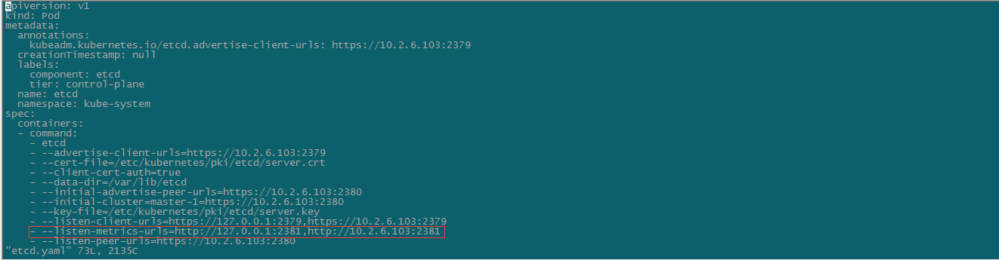
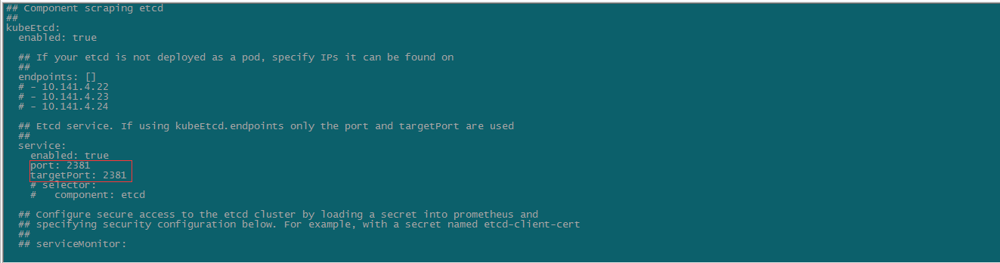
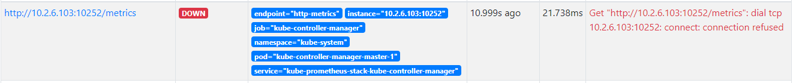
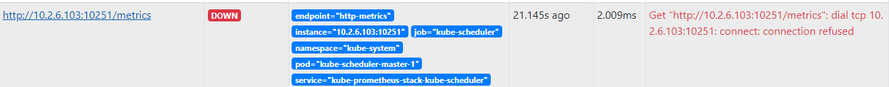
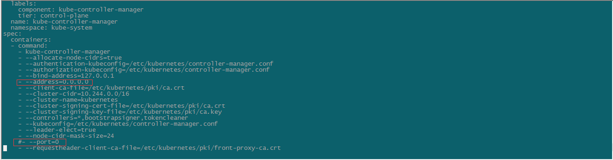
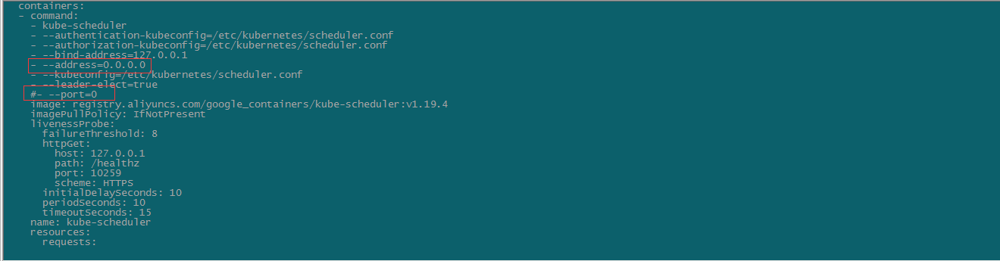
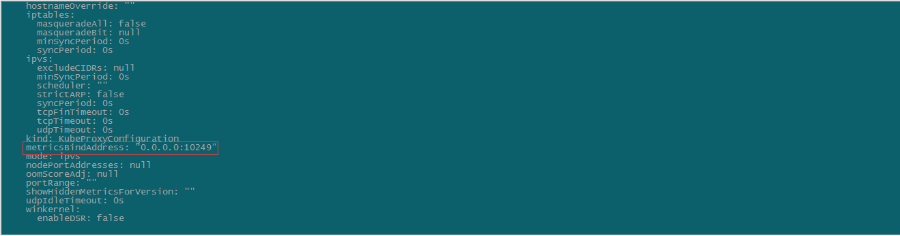

# promethus安装

## helm3安装promethus

```shell
kubectl create namespace monitoring

helm repo add prometheus-community https://prometheus-community.github.io/helm-charts

helm search repo  kube-prometheus-stack

helm pull prometheus-community/kube-prometheus-stack
```

```yaml
#修改value.yaml中的存储部分

    ## Prometheus StorageSpec for persistent data
    ## ref: https://github.com/coreos/prometheus-operator/blob/master/Documentation/user-guides/storage.md
    ##
    storageSpec:
       volumeClaimTemplate:
         spec:
           storageClassName: harbor-ceph-rdb
           accessModes: ["ReadWriteOnce"]
           resources:
             requests:
               storage: 50Gi
    #    selector: {}
```

```shell
helm install kube-prometheus-stack ./kube-prometheus-stack --set rbacEnable=true --namespace=monitoring -f ./values.yaml
```


## 修改配置文件

### 方法一： 修改 alertmanager、prometheus、grafana的访问类型为NodePort

```shell
kubectl edit svc prometheus-operator-grafana -n monitoring #grafana的访问类型 修改type为NodePort        
kubectl edit svc prometheus-operator-alertmanager -n monitoring   
kubectl edit svc prometheus-operator-prometheus -n monitoring
kubectl get svc -n monitoring #查看修改后的访问类型
```

### 方法二：通过 Ingress 来暴漏服务 

```yaml
apiVersion: extensions/v1beta1
kind: Ingress
metadata:
  namespace: monitoring
  name: prometheus-ingress
spec:
  rules:
  - host: grafana.zznode.com
    http:
      paths:
      - backend:
          serviceName: kube-prometheus-stack-grafana 
          servicePort: 80
  - host: prometheus.zznode.com
    http:
      paths:
      - backend:
          serviceName: kube-prometheus-stack-prometheus
          servicePort: 9090
  - host: alertmanager.zznode.com
    http:
      paths:
      - backend:
          serviceName: kube-prometheus-stack-alertmanager
          servicePort: 9093
```

```shell
kubectl apply -f prometheus-ingress.yaml
```

```shell
#修改host文件添加主机映射
10.2.6.154 grafana.zznode.com
10.2.6.154 prometheus.zznode.com
10.2.6.154 alertmanager.zznode.com
```

### 访问界面

grafana.zznode.com 默认用户密码：admin/prom-operator


## prometheus监控K8s的问题

1.etcd无法监控

prometheus默认监控etcd的2379端口，而新版本kubeadm安装的ectd的metrics端口改为2381，故需要修改values.yaml中的ectd端口并重启kubelet，才能完成对etcd的正常监控。



​                                                                               etcd.yaml



​                                                                            values.yaml

2.kube-controller-manager和kube-scheduler无法监控





kubeadm安装默认会有-port=0参数，需要将其注释，添加--address=0.0.0.0的配置并重启kubelet，才能监控。



​                                                                kube-controller-manager.yaml



​                                                                        kube-scheduler.yaml

3.kube-proxy无法监控

默认情况下，kube-proxy服务监听端口只提供给127.0.0.1，需修改为0.0.0.0

```shell
kubectl edit cm/kube-proxy -n kube-system
```



```shell
#重启kube-proxy
kubectl delete pod -l k8s-app=kube-proxy -n kube-system
```

