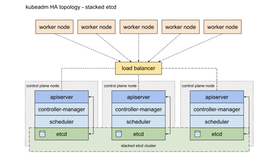

## 概述

本文针对SpringCloud微服务项目如何在K8s环境下部署应用进行阐述，主要分为三个章节:

第一章主要介绍基础环境的安装，包括：K8s集群的安装、Ceph分布式存储集群的安装、Helm包管理工具的安装、Harbor镜像仓库的安装等，通过这些基础环境的搭建为后续微服务应用的部署提供基础支撑能力。

第二章主要介绍应用系统在K8s上的部署过程，通过SpringCloud微服务项目SDP的案例来演示如何在K8s环境上完成微服务的部署，其中涉及如何改造配置文件以适配K8s环境、Docker镜像的制作、YAMl文件的编写等具体步骤。

第三章主要介绍如何在K8s环境中进行日常的运维工作，包括日志的采集工具EFK的使用、服务的监控工具Prometheus的使用以及调用链的跟踪工具SkyWalking的使用等。

## 基础环境安装

### K8s安装

本文采用1.22版本的K8s，通过搭建三Master节点的高可用集群作为样例，其架构如下图所示：



具体安装步骤参见`deploy/k8s安装.md`文档。

### Ceph安装

本文使用Octopus版本的分布式存储集群Ceph，支撑K8s中PV的创建，用于后续Mysql、Redis等数据的存储。

本节由一个三节点的Ceph集群的安装作为样例。

具体安装步骤参见`deploy/Ceph安装.md`文档。

### Helm安装

本文采用Helm作为K8s中的包管理工具，为后续组件的安装提供支撑。

在K8s的master节点上执行以下命令以进行安装：

```shell
curl https://raw.githubusercontent.com/helm/helm/master/scripts/get-helm-3 > get_helm.sh;
chmod 700 get_helm.sh;
./get_helm.sh;
```

### Ingress安装

本文采用Ingress作为K8s集群统一对外入口。

具体安装步骤参见`deploy/Ingress安装.md`文档。

### Harbor安装

本文采用Harbor作为镜像仓库，用存储整个集群中的镜像文件。

本节采用Helm部署Harbor（安装Harbor前必须先安装Helm），对应CHART VERSION和APP VERSION分别为1.7.1、2.3.1。

具体安装步骤参见`deploy/Harbor安装.md`文档。

### EFK安装

待补充

### Prometheus安装

本文采用Prometheus作为K8s环境的监控工具，具体安装步骤见`deploy/Promethus安装.md`文档。

### SkyWalking安装

待补充

### Kuboard安装

本文采用Kuboard作为K8s界面管理工作，用于K8s环境的运维。

本节采用K8s部署Kuboard，在K8s的master节点上执行以下命令进行安装：

```shell
kubectl apply -f https://addons.kuboard.cn/kuboard/kuboard-v3.yaml
```

安装完成后会自动导入集群，默认的访问地址如下：

默认访问地址：http://your-node-ip-address:30080

默认用户：admin

默认密码：Kuboard123

## 应用系统部署

本文以SpringCloud的微服务SDP项目为例，演示如何将应用系统部署到K8s中。

具体内容见`apply/应用系统部署.md`文档。


## 应用系统运维

### EFK使用配置

待补充

### Prometheus使用配置

Prometheus监控告警配置见`apply/Prometheus自定义监控配置.md`文档。                    

### SkyWalking使用配置

待补充